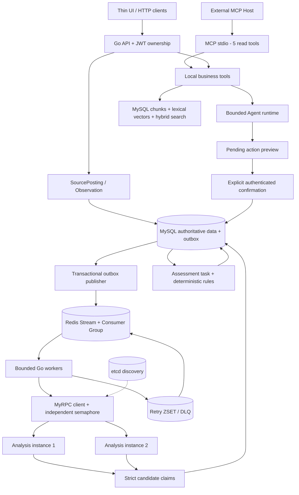

# CampusTrace 1.0 — Full Interview Edition

**An evidence-first campus recruiting workflow backend built in Go.**

A job page returning HTTP 200 does not mean the role is still open. A model saying “eligible” is not evidence. Campus recruiting has graduation, degree and job-type constraints that need explicit rules. CampusTrace records **what was observed, when, and why an assessment exists**.

This is a new domain implementation, with synthetic demonstrations. It does not apply to jobs automatically, invent personal experience, or claim production adoption.

## Core ideas

- A canonical Job can have several source postings. Each actual observation is immutable input; its extraction state can advance independently.
- Evidence has a source observation, verbatim/normalized excerpt, method and confidence. Candidate model claims are strictly decoded and validated before persistence.
- Job status, eligibility, technology fit, preference ranking and application state are distinct concepts.
- MySQL transactions and unique constraints provide correctness. Redis provides queueing, retries, rate limits, caches and short-lived Agent state.
- Analysis is the **only** remote business service. It returns candidate claims over the existing KanaRPC/MyRPC framework. The main backend owns decisions and CRUD.

## Architecture



## Evidence and eligibility

`Source → Observation → Evidence → Deterministic Rules → Assessment`.

Sources are operator-attested `OFFICIAL`, `THIRD_PARTY` or `MANUAL`. Public API imports use a user-owned `PRIVATE` manual source and cannot grant themselves official trust. Official/system sources remain `GLOBAL`. Private manual observations never merge into the shared catalog. A local operator can register sources using `cmd/ingest`.

Canonicalization first matches source + external ID, then a source-scoped URL as **posting** identity. A versioned structured digest only finds cross-source candidates; reuse also checks company ID, normalized title, job type, canonical location set, and source identity. External IDs and URL path/query preserve case; content uses exact bytes. No fuzzy/LLM merge. Posting JSON stores the rationale. Uncertain matches remain separate. Without a stable external ID or URL, changed manual text may form a separate job; supply a stable external ID when observing a manual posting again.

Status: recent official application evidence without closure permits `OPEN`; explicit official closure/expired deadline permits `CLOSED`; conflicting/insufficient or third-party-only evidence needs verification; failed/stale official observations yield `UNKNOWN`. HTTP 200 alone never opens a job. Latest observations are selected per posting; previous successes cannot hide a newer 403. Worker enqueues hourly freshness reassessments using stored observations, with up to one hour of status-cache lag. It does not automatically re-fetch sites.

Assessment history is append-only. Successive successful content hashes drive content/structured changes. SQL receipts and Redis cache share a complete `ProcessingVersion`: semantic/model/prompt configuration, implementation parser version, source adapter/parser version and the observation parser version. Change `ANALYSIS_VERSION` when changing a model or extraction prompt; parser-only changes invalidate receipts automatically. At scheduling (`BindAnalysis`), a previously unseen processing identity receives a numeric generation and becomes the observation's explicit desired/active generation. Queued tasks are durably bound to that identity. Replaying a known old identity never reactivates it; version strings are never sorted. Only the active generation may become current. Late old results remain historical; active receipt replay reconciles the pointer and replaces derived apply/deadline fields atomically. While the desired generation is pending, old-generation evidence is excluded from current rules. Deployment must schedule the desired implementation before relying on it; this is explicit request order, not automatic inference of release chronology from version names. To intentionally redo or roll back an implementation, use a new processing configuration identity. A full history selection interface remains outside 1.0.

Eligibility produces eight rule results: graduation, degree, job type, location, experience, major, language and technical requirements. Missing graduation/degree/job-type evidence is critical `UNKNOWN`. Explicit hard failure wins; unresolved evidence beats preference conditions. Location and preferred job type are preferences (`CONDITIONAL`), not fabricated legal eligibility constraints. Majors/languages/experience become hard requirements when identified. Optional technology signals do not override explicit `REQUIRED:` constraints.

GoFit is independent: `EXPLICIT_GO`, `LANGUAGE_FLEXIBLE`, `NO_GO_SIGNAL`, `CONFLICTING`, `UNKNOWN`. Ranking is a weighted sum with a visible breakdown; configure all weights through `RANKING_WEIGHTS`.

The conservative offline parser supports explicit labels in [testdata/import.json](testdata/import.json), common `2027届`, `本科及以上`, Go/Golang and apply/closed text. It does not claim broad natural-language extraction quality.

## Application and interview workflow

Applications follow `PLANNED → APPLIED → OA / INTERVIEW → HR / OFFER`, with permitted rejection/withdrawal transitions. Every transition locks/validates current state and expected version, inserts an event and updates the application in **one MySQL transaction**. Closed jobs do not terminate applications. Terminal application states cannot be reopened in 1.0.

Interviews and reviews belong to their application owner. Reviews are append-only, one per interview. Validated weak topics accumulate count, severity, first/last seen and review references. Preparation exposes `current_requirements` and `current_observations` from the same input snapshot as eligibility/technology fit, plus verified project facts (including limitations), weak topics and retrieved knowledge. Historical requirements are not mixed into this field. Priorities currently use weak-topic severity × occurrence count.

## Reliable async pipeline

One Stream carries `ANALYZE` and `ASSESS` envelopes. Publishing outbox rows may duplicate after a crash; consumers tolerate this. SQL analysis results and completed assessment-task keys are the correctness boundaries.

Workers use a fixed pool. MyRPC calls have a separate semaphore; model and embedding work have separately configurable limits. PEL recovery uses `XAUTOCLAIM` with idle time greater than the task deadline. Crash-after-commit-before-ACK is explicitly tested.

Transient failures use exponential backoff (2s, 4s, 8s...) with jitter. Redis Lua atomically stores retry/DLQ state and ACKs. Another Lua script transfers due retry members into the Stream and removes them atomically. Permanent schema/auth/validation failures go directly to DLQ. Terminal analysis failure is recorded in MySQL and reassessed as unknown. Malformed envelopes are retained in a sanitized DLQ task entry; raw malformed payload preservation is not implemented.

Inspect/redrive deliberately through the local operator CLI:

```sh
go run ./cmd/dlq
go run ./cmd/dlq -redrive TASK_ID
```

Sliding-window rate limits use Redis server time and atomic ZSET/Lua remove/count/accept/record, with source-specific keys plus global LLM/embedding keys. Redis is standalone in 1.0 (the multi-key Lua scripts are not Redis Cluster slot-aware). Stream/completed-task/outbox history retention is manual; do not run indefinitely without adding archival policies.

## MyRPC integration

CampusTrace is the independent module `github.com/KanaDoodle/CampusTrace`. It imports only `github.com/KanaDoodle/KanaRPC-Go/rpc`. The narrow public facade supplies registry construction/discovery/readiness, client invocation with context, handler registration and server lifecycle. Transport, codecs, pools and breaker implementation types stay internal to KanaRPC.

CampusTrace pins `github.com/KanaDoodle/KanaRPC-Go v0.1.0` from the maintainer's [public repository](https://github.com/KanaDoodle/KanaRPC-Go). `go.mod` has no replacement. Normal builds use `GOWORK=off` and require no sibling checkout. The RPC API is a v0.x public facade and does not yet promise long-term API stability.

For optional local co-development only, `make dev-workspace` creates an ignored `go.work` pointing to a sibling checkout. `make verify-boundary` checks the current source against the pinned published module with the workspace disabled; it does not replace the separate remote clean-clone acceptance procedure.

Two instances register in etcd. Known breaker-open instances are excluded before load balancing; admission races permit at most one selection attempt per discovered address. Remote business methods are never automatically replayed. Local cancellation is neutral to the breaker; backend deadlines still count. Lost KeepAlive/lease triggers degraded readiness, capped exponential backoff with jitter, a new lease and registration recovery. Analysis exposes `/healthz` and `/readyz` at `ANALYSIS_HEALTH_ADDR` (local default `127.0.0.1:19191`; the second launch uses `19192`). Tests revoke a real lease and inject a closed KeepAlive channel.

The RPC wire protocol still has no early remote cancellation signal. CampusTrace carries an explicit deadline and IDs; server work stops on that deadline or service shutdown.

## Agent / RAG / MCP

Default `DemoModel` is an explicitly deterministic offline natural-language router. Optional `LLM_URL`, `LLM_API_KEY`, `LLM_MODEL` enable an OpenAI-compatible chat endpoint; ordinary tests use scripted models and never require external credentials.

The model selects tools through at most 4 calls / 8 executions; deadline 35s and per-tool timeout 8s are configurable. All tool arguments are validated at runtime, including unknown fields, trailing JSON, nulls, required fields, enums, ranges and size. Last-step proposals are traced but never executed.

Final business-fact narration is rendered deterministically from successful tool observations. **Model final prose is not presented as factual truth.** This deliberately limits free-form conversational synthesis, while the model can still decide which structured tools or knowledge to retrieve. Project facts are explicitly labelled IMPLEMENTED/LIMITATION/PLANNED and only verified facts establish a claim. Retrieved instructions cannot invoke arbitrary tools or skip confirmation.

Write tools only store a validated PendingAction with user ownership and a 10-minute TTL. `POST /agent/actions/{id}/confirm` requires `{"confirm":true}`, then revalidates current state/version. Confirmation first reads a completed MySQL receipt scoped by action ID and authenticated user, so replay survives missing/unavailable Redis pending data. Without a receipt, owner/TTL/current workflow state/version are validated as usual; Redis absence and backend errors remain distinct. MySQL action receipts make concurrent/repeated confirmations idempotent. The model has no confirmation tool.

Session memory is scoped by user and session, at most 6 complete turns/32KB, 30-minute TTL with optimistic version checks. Concurrent session saves may skip the stale writer rather than overwrite newer memory. Failure traces are sanitized and retained 24h; a Redis outage can prevent trace persistence. Session content is not business evidence.

RAG persists documents/chunks/vectors in MySQL. Its default embedding is **deterministic lexical hashing into 128 dimensions**, not a semantic embedding model. Retrieval uses brute-force cosine + keyword overlap over at most 10,000 owner-scoped chunks, Top-K ≤20. The restartable release migration adds `chunks(user_id,id)` for the owner-filtered scan. Ingestion that would exceed 10,000 chunks is rejected atomically with `CORPUS_CAPACITY`; an existing oversized corpus also returns that explicit error instead of silently advertising full-corpus Top-K. HTTP/UI surface this capacity error. Duplicate document import, update and delete lifecycle remain Known Limitations. No ANN, vector database or hidden external embedding call. Chinese bigrams provide basic lexical support.

`POST /agent/decide` returns the final result. `/agent/stream` emits run_start, model_start/end, tool_start/result, final and error over bounded direct SSE writes. Disconnect cancels Context; token streaming/replay/reconnect are out of scope.

Official Go MCP SDK `v1.7.0`: a standalone stdio server exposes five read tools: search_jobs, get_job, get_job_evidence, get_job_eligibility, search_knowledge. Stdout is protocol-only; logs go to stderr. Local Agent tools do not round-trip through MCP. These are business-workflow read-only tools. MCP/Agent queries reuse an unexpired assessment for identical inputs, or compute a current result without inserting eligibility/ranking/history rows. Redis knowledge rate-limit counters may still change. Explicit/background assessment persists through input-identity CAS and unchanged-input deduplication. Profile revisions increment on saves; current observation/generation, job metadata and rule/weight versions are included. Time-dependent cached results expire within one minute or at the next deadline/freshness boundary.

## Quick start

Prerequisites: Go 1.25.9+, Git, Docker Compose and network access to public Go modules. The repository name and module path use **CampusTrace** with this exact capitalization. No KanaRPC sibling checkout or development workspace is needed.

```sh
git clone https://github.com/KanaDoodle/CampusTrace.git
cd CampusTrace
export GOWORK=off
go mod download
make deps                  # MySQL 13306, Redis 16379, etcd 12379, localhost-bound
make seed                  # schema migration + synthetic fixtures; safe to rerun
make run                   # API + worker + two analysis instances
# Open http://127.0.0.1:8080
```

Demo login: `demo@campustrace.local` / `Synthetic-demo-2027`.

`make run` defaults to an explicitly local demo JWT secret; configure `JWT_SECRET` (32+ bytes) for a different environment. Processes log to `bin/`; `make stop` sends TERM only to the matching project binaries. For a supervised foreground run: `make build && FOREGROUND=1 ./scripts/start.sh`. Infrastructure is stopped separately with `docker compose stop`; volumes are retained.

Each binary also runs independently with env config from [configs/local.env.example](configs/local.env.example). The example is documentation, not shell-sourceable when its DSN contains `&`; use properly quoted exports. Only MySQL/Redis/etcd are in Compose; Go services run on the host and use the pinned published KanaRPC module. No all-in-one published image is claimed.

Manual imports:

```sh
go run ./cmd/ingest -file testdata/import.json
go run ./cmd/ingest -format csv -file testdata/import.csv
# Operator-attested source registration (no automatic trust inference):
go run ./cmd/ingest -register-source -source company-careers -name 'Example careers' -type OFFICIAL -trust OFFICIAL
```

Public URL import is available in UI/API; captchas, login requirements and 403s are recorded without bypass. HTTP fetches reject private/loopback/link-local addresses, including redirects/DNS resolution. Only explicit text/HTML content types are parsed. Reading more than 1 MiB of decompressed response content, unsupported encodings or binary types returns `PARSE_ERROR`, with no partial text treated as a complete observation.

For MCP, log in through `/auth/login`, then provide its JWT as `MCP_TOKEN` with the same `JWT_SECRET` and database config before running `go run ./cmd/mcp-server`. Token is verified at process startup; restart the stdio server to change identity or revoke access. Mid-session JWT expiry/revocation is not enforced in 1.0.

## Demo

1. Jobs: search `Cedar` and open `Go backend engineer`.
2. Inspect two observations, changed hashes, deadline/technology changes and assessment history.
3. Compare graduation/degree pass, hard-fail and unknown profiles/jobs; view independent GoFit/ranking.
4. Applications: inspect synthetic PLANNED/APPLIED/OA/INTERVIEW history; change state using its displayed version.
5. Interviews / Weak Topics: review the stored PEL weakness; open job preparation context to see it included.
6. Agent: ask `为什么岗位 JOB_ID OPEN？` or `我的项目做了什么？`. It queries this run's structured facts.
7. Ask `创建申请 JOB_ID` for a job without an application. Review the pending preview before the separate confirmation button.

Seed content and relationships are deterministic examples; IDs and reference-relative timestamps are generated per fresh database. All companies, jobs and project claims are explicitly synthetic.

## Testing and actual measurements

```sh
go test ./...
go test -race ./...
go vet ./...
make integration           # creates/grants campustrace_test, then real dependency tests
CAMPUS_INTEGRATION=1 go test -race -count=1 -v ./internal/integration
make eval                  # 24 scripted runtime contract cases, NOT live-model accuracy
make loadgen               # 100 synthetic observations through the running worker/MyRPC
```

Regular tests explicitly skip integration without `CAMPUS_INTEGRATION=1`; final verification also runs them enabled. `MYSQL_TEST_DSN` can override the separate integration database. Tests retain synthetic rows within that test database. Local operator database privileges are needed for test-database creation in the Make target; tests themselves use the non-root `campus` account.

Remote reproducibility is checked by cloning this repository outside a development workspace, using `GOWORK=off` and a fresh `GOPATH` / `GOMODCACHE`, running download/test/race/vet/build and the Quick Start + Demo flows. Frontend regressions run with `node --test web/display.test.cjs`. Local measurements alone do not establish remote reproducibility.

## Known limitations

- Limited rule parser/public HTTP adapter; no JS rendering, login automation, anti-bot bypass or automatic job application.
- Source trust is operator-attested; the system does not prove domain ownership or verify a third-party board's authenticity.
- Exact canonicalization intentionally under-merges and includes the initial content fingerprint. Changed postings stay attached by external ID/URL; cross-source aliases with changed text may remain separate.
- JSON-backed SQL aggregates plus relational ownership/FK/unique keys optimize implementation clarity for personal scale. No schema downgrade tool, document revisions, rich search pagination or multi-tenant administrative roles.
- Historical evidence versions remain stored. Explicit scheduling selects an active processing generation; older completions cannot replace its current evidence. Untouched legacy observations require explicit reanalysis. No all-history migration or version-switching UI is provided.
- Old official contradictions conservatively produce verification/unknown outcomes. Freshness status cache may lag one hour; no automatic site recrawl schedule.
- The v0.x KanaRPC API and remote cancellation limitations described above; educational framework, not a production RPC-platform claim.
- Free-form model answers are intentionally withheld in favor of grounded rendering. Optional live provider and semantic embedding quality have not been evaluated. Weak-topic extraction currently uses validated explicit input, not an LLM extractor.
- SSE no replay/reconnect; MCP auth is startup-scoped; no account email verification/password reset/revocation service.
- No automatic queue/history archival or Redis Cluster support. DLQ has operator-only CLI access. Redis metrics are process-local counters, reset on restart: API `/metrics`, worker `127.0.0.1:18081/metrics`.
- The Chinese-first UI uses structured profile and review forms and has a 100-result job search cap. No frontend framework is used.

## Roadmap

Evolve the existing public RPC facade under v0.x; add source-specific adapters and future schema migrations; semantic embedding provider with evals; structured review extraction; retained-history archival; richer UI/profile forms. None of these planned features is described as implemented.

License: GNU Affero General Public License, Version 3 (AGPL v3); see the existing [LICENSE](LICENSE) and the upstream notice in [dependency audit](docs/dependency-audit.md). The license text is unchanged.

## Repair migration and semantics

Startup migrations are serialized and restartable. Existing IDs, raw text and history are retained. Legacy manual data has no reliable owner: jobs touched by those sources (including mixed jobs) are quarantined as private with no assigned user. An operator must review the original provenance before assigning ownership or reconstructing a public job; the repair does not guess or expose these records. Existing wrongly merged historical jobs are not automatically split. Posting lookup keys are upgraded while retaining IDs. Stop old writers before migrating; mixed old/new binaries are unsupported.

New manual sources default to `Asia/Shanghai`. An operator can specify `-timezone` and `-owner` in `cmd/ingest`. Date-only deadlines expire at the start of the next day in the source timezone; timestamps with explicit offsets retain their instant. Cache namespace `cache-v2`, semantic implementation `claims-v3-semantics`, complete `processing-v3-*` identity and exact text digest invalidate older cache/receipt identities. The effective semantic version is enforced even when an old environment still sets `claims-v1`; custom model/prompt versions are namespaced and hashed within the SQL length limit. Historical assessment rows remain historical. Reanalyzed observations select only evidence from their current analysis version; untouched historical observations require explicit reanalysis or a new observation.

Application/closure claims require both excerpt binding and conservative signal support. Conflicting positive/negative observations cannot become OPEN merely because a positive phrase exists. Ranking `breakdown_sources` separates evidence assessments, user preferences and job/observation metadata. Latest metadata from a stable posting refreshes title/type/locations; older observations cannot overwrite it.

Malformed Stream messages use a separate `poison` hash with bounded diagnostic text, message digest, timestamp, consumer and recoverable correlation ID. Failed quarantine keeps the message pending. Failure transfer preflights Redis key types/group, writes retry/DLQ before a v2 completion marker, and acknowledges last. Lua runtime errors do not roll back earlier writes; stable transfer bytes allow safe reruns. Legacy premature markers are not trusted.

### Release repair runtime bounds

`AGENT_MAX_TOOL_RESULT_BYTES` defaults to 32,768; `AGENT_MAX_FACTS_BYTES` to 98,304; `AGENT_MAX_ANSWER_BYTES` to 32,768; `AGENT_MAX_FINAL_BYTES` to 163,840 (minimum effective final budget 512 bytes for the terminal envelope). Nonpositive values use defaults. The final budget includes serialized JSON and SSE framing. Oversized tool results are rejected before entering Facts; output reduction ends in `OUTPUT_LIMIT`, never a silently complete answer. Same-step duplicate call IDs execute once; validated canonical read/action arguments reuse the first result and the same pending action. Later model steps may reread.

PEL recovery retains the stream/group cursor across bounded passes (at most 32 XAUTOCLAIM commands per pass) and claims one message for each serial worker's one available slot. Work remains at-least-once: an executing task that exceeds its claim idle timeout can still be reclaimed; no fencing or lease renewal is claimed.
