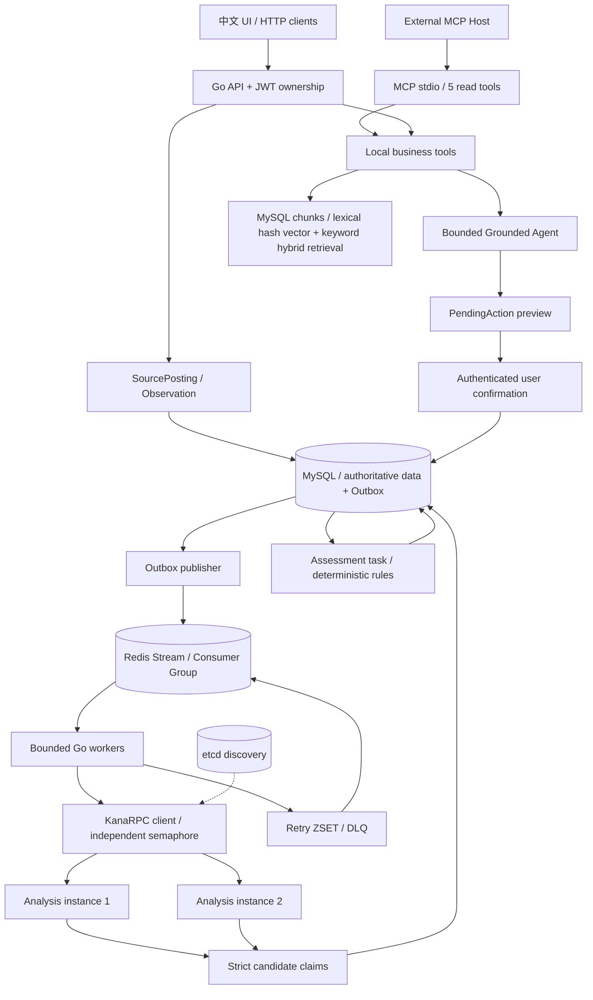

# CampusTrace

**中文** | [English](README_EN.md)

**面向应届校招的可信岗位情报与 AI 求职工作流平台**

*Evidence-first campus recruiting workflow backend built in Go.*

> 招聘页面仍然可以访问，并不代表岗位仍然开放；
>
> 大模型认为你符合要求，也不意味着这个结论有可靠依据。

CampusTrace 用 Go 将岗位观察、证据核验、校招资格判断、投递记录和面试复盘串成一条可追溯的工作流。它关注的不只是“给出答案”，而是**观察到了什么、什么时候观察到、结论依据是什么，以及哪些地方仍然不知道**。

这是使用 synthetic demo data 展示的学习与工程实践项目。它不会自动投递岗位、编造个人经历，也不以演示数据代表实际用户规模或线上效果。

## CampusTrace 是什么

你可以导入岗位、查看招聘信息的变化与来源，结合个人资料核对 Eligibility，分别查看 GoFit 和投递优先级，再记录投递、面试与复盘。Grounded Agent 使用受约束的业务工具查询这些信息；涉及写入时，先给出预览，再由用户明确确认。

面向求职者，它帮助区分“岗位是否开放”“我是否符合要求”“是否值得优先投递”；面向 Go 后端面试官和 GitHub 开发者，它展示一套围绕真实业务约束实现的事务、异步处理、RPC 服务治理与 Agent 工具执行边界。

## 为什么做这个项目

校招信息常常存在几个不同的问题：页面还在，但投递入口已经关闭；岗位描述没有写清毕业年份；第三方转载与官方信息矛盾；模型给出了肯定答案，却没有可核对的出处。

CampusTrace 将这些问题拆开处理：来源可信度需要明确登记，信息变化需要保留历史，资格判断需要规则和证据，偏好评分不能冒充硬性资格，模型输出也不能直接成为事实。

## 核心思想：Observation → Evidence → Assessment

```text
Source → Observation → Evidence → Deterministic Rules → Assessment
```

| 层次 | 保存什么 | 如何约束结论 |
| --- | --- | --- |
| Observation | 一次实际观察的原始输入、时间和抓取结果 | 输入不可变，提取处理状态可独立推进；新的失败不会被旧的成功掩盖 |
| Evidence | 来源 Observation、原文或规范化摘录、提取方法和置信度 | 候选 claims 必须经过严格解码、摘录绑定与保守信号验证，才能持久化 |
| Assessment | 基于当前输入与确定性规则生成的判断 | 保留追加历史，区分确定结论、冲突、待核验与未知 |

近期官方投递证据且没有关闭信号，才允许判断 `OPEN`；明确官方关闭或截止时间已过，可以判断 `CLOSED`。信息不足、相互矛盾或仅有第三方证据需要核验；官方观察失败或过期会产生 `UNKNOWN`。**HTTP 200 本身不是开放证据。**

岗位状态、Eligibility、GoFit、偏好排名和投递状态相互独立。岗位关闭不会自动终止已经进行中的投递。

## UI Screenshots

当前公开仓库尚未包含可引用的 UI 截图，因此此处不展示占位图或仓库外审计图片。可按下方 Quick Start 启动中文界面，重点查看**岗位详情、Evidence Timeline、Eligibility 和求职助手**；具体演示步骤见 [Demo](#demo)。

## Architecture



MySQL 事务与唯一约束承担业务正确性；Redis 承担队列、重试、限流、缓存及短期 Agent 状态。**Analysis 是唯一远程业务服务**：它通过 KanaRPC 返回候选 claims，主后端保留决策与 CRUD 职责。

## Core Features

### 岗位来源、归并与变化记录

- 来源为运营者登记的 `OFFICIAL`、`THIRD_PARTY` 或 `MANUAL`；可信度不是系统自动认证的。公共 API 导入只能创建用户自有的 `PRIVATE` manual source，不能自行赋予官方可信度。官方/系统来源为 `GLOBAL`，私人观察不会并入共享岗位库。
- 一个 canonical Job 可以对应多个 SourcePosting。先按来源与 external ID 匹配，再按来源内 URL 确定 posting 身份；结构化摘要仅用于寻找跨来源候选，还需核对公司、规范化标题、岗位类型、地点集合与来源身份。归并依据保存在 posting JSON 中，不做模糊或 LLM 归并。
- External ID、URL path/query 保留大小写，内容按精确字节处理。不确定的候选保持分离；没有稳定 external ID/URL 的手工文本发生变化时，可能形成新岗位。
- 连续成功观察的内容 hash 用于记录内容与结构化变化；每个 posting 取最新观察。Worker 每小时用已有观察重新评估 freshness，状态缓存最多可能滞后一小时，**不会自动重新抓取网站**。

### Eligibility、GoFit 与投递优先级

Eligibility 分别检查毕业年份、学历、岗位类型、地点、经验、专业、语言和技术要求。毕业年份、学历或岗位类型缺少证据时属于关键 `UNKNOWN`；明确硬性不符优先，未解决的证据问题优先于偏好条件。

地点和偏好岗位类型属于 `CONDITIONAL` 偏好，不伪装成硬性资格约束。已识别的专业、语言和经验要求可以成为硬约束；可选技术信号不能覆盖明确的 `REQUIRED:` 条件。

GoFit 独立输出 `EXPLICIT_GO`、`LANGUAGE_FLEXIBLE`、`NO_GO_SIGNAL`、`CONFLICTING` 或 `UNKNOWN`。Ranking 使用可见的加权分解，通过 `RANKING_WEIGHTS` 配置全部权重；`breakdown_sources` 区分证据判断、用户偏好和岗位/观察元数据。

离线 parser 仅保守支持 [导入示例](testdata/import.json) 中的显式标签，以及常见的 `2027届`、`本科及以上`、Go/Golang 和投递/关闭文本，不代表通用自然语言提取能力。

### 投递、面试与准备上下文

投递按 `PLANNED → APPLIED → OA / INTERVIEW → HR / OFFER` 及允许的拒绝/撤回路径流转。一次状态变更在同一个 MySQL 事务中锁定并验证当前状态、校验 expected version、插入事件并更新记录；1.0 不支持重新打开终态投递。

面试和复盘归属于对应投递的用户。复盘为追加记录，每次面试一份；经验证的显式薄弱知识点累积次数、严重程度、首次/最近出现时间与复盘引用。准备上下文使用与 Eligibility/GoFit 相同的输入快照，展示 `current_requirements`、`current_observations`、已核验项目事实及限制、薄弱知识点和检索知识，不混入历史要求。准备优先级目前为严重程度 × 出现次数。

## Reliable Async Pipeline

```text
MySQL Outbox → Redis Stream → Worker → KanaRPC Analysis
                                      ↓
                             Evidence → Assessment
```

整体采用 **at-least-once** 投递。Outbox 在崩溃后可能重复发布，业务结果通过数据库幂等收敛；SQL analysis result 与已完成 Assessment task key 是正确性边界。

- 同一个 Stream 承载 `ANALYZE` 和 `ASSESS` envelope。Worker 使用固定池，RPC 有独立 semaphore；模型和 embedding 工作另有可配置并发上限，不意味着默认使用外部 embedding 服务。
- PEL 通过 `XAUTOCLAIM` 恢复，idle time 大于任务 deadline。恢复在有界轮次间保留 stream/group cursor，每轮最多 32 次命令；每个串行 worker 只为一个空闲槽 claim 一条消息。任务执行超过 claim idle timeout 时仍可能再次被 claim，没有 fencing 或 lease renewal。
- 临时失败按 2s、4s、8s 等指数退避并加入 jitter。Lua 将 retry/DLQ 状态记录与 ACK 放在同一操作中；另一个脚本将到期 retry 原子转回 Stream。永久 schema/auth/validation 错误直接进入 DLQ。终态分析失败写入 MySQL，并重新评估为未知。
- 测试覆盖数据库已提交、ACK 前崩溃的场景。异常 envelope 被保存为净化后的 DLQ 记录；`poison` hash 保留有界诊断、digest、时间、consumer 与可恢复的关联 ID，不保留完整畸形原始 payload。隔离失败则继续留在 PEL。
- 失败转移先检查 Redis key 类型/group，写 retry/DLQ 后写 v2 completion marker，最后 ACK。Lua 运行时错误不会回滚已发生的写入，因此使用稳定转移字节支持重跑，不信任旧的提前完成 marker。

DLQ 由本地 operator CLI 查看和主动 redrive：

```sh
go run ./cmd/dlq
go run ./cmd/dlq -redrive TASK_ID
```

滑动窗口限流使用 Redis server time 和原子 ZSET/Lua，包含来源独立 key 及全局 LLM/embedding key。当前使用 standalone Redis，多 key Lua 不支持 Redis Cluster slot 分布。Stream、完成任务和 Outbox 历史需要人工保留策略，尚无自动归档。

## KanaRPC Integration

KanaRPC 是本项目维护者基于上游 KamaRPC-Go 历史持续实现与维护的**自研轻量 RPC / 服务治理框架**，属于学习与工程实践项目；来源与许可见 [KanaRPC 仓库](https://github.com/KanaDoodle/KanaRPC-Go) 和 [dependency audit](docs/dependency-audit.md)。CampusTrace Analysis Service 是它的真实业务消费者。

CampusTrace 是独立 module `github.com/KanaDoodle/CampusTrace`，固定依赖已发布的 `github.com/KanaDoodle/KanaRPC-Go v0.1.0`，仅导入公开的 `/rpc` facade。`go.mod` 无 replace，正常构建使用 `GOWORK=off`，无需 sibling checkout。Transport、codec、pool 与 breaker 实现类型留在 KanaRPC internal 内。v0.x facade 尚不承诺长期 API 稳定性。

两个 Analysis 实例注册到 etcd。已知 breaker-open 实例在负载均衡前被排除；admission race 下每个已发现地址最多尝试一次选择，远程业务方法不自动重放。本地取消不计入 breaker 失败，后端 deadline 仍计入。

KeepAlive/lease 丢失会降低 readiness，并以有上限的指数退避和 jitter 创建新 lease、恢复注册。`/healthz`、`/readyz` 使用 `ANALYSIS_HEALTH_ADDR`，本地两实例默认为 `127.0.0.1:19191` / `19192`；测试包含真实 lease revoke 与关闭 KeepAlive channel。

RPC wire protocol 没有提前远程取消信号；CampusTrace 传递显式 deadline 和 IDs，服务端工作到 deadline 或服务关闭时停止。这些实现边界不构成对成熟生产级 RPC 框架的性能或能力优势声明。

可选本地联合开发使用 `make dev-workspace` 生成 ignored `go.work`。`make verify-boundary` 在关闭 workspace 后验证已发布依赖边界，不能替代远程 clean clone 验收。

## Grounded Agent / RAG / MCP

### Grounded Agent：模型选工具，事实来自成功的工具观察

默认 `DemoModel` 是确定性的离线自然语言路由器；配置 `LLM_URL`、`LLM_API_KEY`、`LLM_MODEL` 可选接入 OpenAI-compatible chat endpoint。普通测试使用 scripted models，不需要外部凭据。

默认预算最多 4 次模型调用、8 次工具执行，总 deadline 35s、单工具 timeout 8s，时间限制可配置。运行时校验未知字段、尾随 JSON、null、必填项、枚举、范围和大小；最后一步提案只记录 trace，不执行。

最终业务事实由成功的工具 observations 确定性渲染，**模型自由文本不会直接作为事实答案展示**。项目事实标记为 `IMPLEMENTED` / `LIMITATION` / `PLANNED`，只有已核验事实支持能力声明；检索内容中的指令不能任意调用工具或绕过确认。

写工具只保存归属用户、TTL 10 分钟的 PendingAction。`POST /agent/actions/{id}/confirm` 必须携带 `{"confirm":true}`，随后重新验证当前状态和版本。已完成的 MySQL receipt 按 action ID 与认证用户读取，即使 Redis pending 数据缺失或不可用，仍能重放完成结果；未完成时照常校验 owner/TTL/状态/版本，并区分数据不存在与后端错误。并发或重复确认通过数据库 receipt 幂等处理，模型没有确认工具。

会话按用户和 session 隔离，最多 6 个完整 turn / 32KB，TTL 30 分钟并带乐观版本检查；过期的并发 writer 可能跳过保存。失败 trace 净化后保留 24 小时，Redis 故障可能导致 trace 无法持久化。会话内容不属于业务 Evidence。

输出预算默认为：`AGENT_MAX_TOOL_RESULT_BYTES=32768`、`AGENT_MAX_FACTS_BYTES=98304`、`AGENT_MAX_ANSWER_BYTES=32768`、`AGENT_MAX_FINAL_BYTES=163840`。非正值回到默认；final 最小有效预算为 512 bytes，包含 JSON 与 SSE framing。超限工具结果不进入 Facts，无法容纳的输出以 `OUTPUT_LIMIT` 结束，不伪装成完整答案。同一步重复 call ID 只执行一次；验证后的相同规范化参数复用首次结果与 pending action，后续模型步骤仍可重新读取。

### RAG：lexical hash vector + keyword hybrid retrieval

文档、chunks 与 vectors 存在 MySQL。默认是 **128 维 deterministic lexical hashing**，结合 brute-force cosine 和 keyword overlap；中文 bigram 提供基础词法支持。它不是 semantic embedding，不依赖 ANN、向量数据库或隐式外部 embedding 调用。

每次最多扫描 10,000 个 owner-scoped chunks，Top-K ≤20，迁移提供 `chunks(user_id,id)` 索引。超容量导入原子拒绝并返回 `CORPUS_CAPACITY`；已有超容量语料也明确报错，HTTP/UI 会展示该错误，不声称返回完整语料的 Top-K。重复导入、文档更新和删除生命周期尚未实现。

### SSE 与 MCP

`POST /agent/decide` 返回最终结果；`/agent/stream` 通过有界直接 SSE 写入发送 run_start、model_start/end、tool_start/result、final 和 error。断开连接取消 Context；不支持 token streaming、重放或断线续传。

独立 stdio MCP server 使用官方 Go MCP SDK `v1.7.0`，提供五个业务只读工具：`search_jobs`、`get_job`、`get_job_evidence`、`get_job_eligibility`、`search_knowledge`。stdout 仅输出协议，日志走 stderr；本地 Agent 工具不经 MCP 绕行。

MCP/Agent 查询复用相同输入的未过期 Assessment，或计算当前结果而不插入 Eligibility/Ranking/history；Redis 知识限流计数仍可能变化。显式/后台 Assessment 通过 input-identity CAS 与相同输入去重持久化。输入身份包含 profile revision、当前 Observation/generation、岗位元数据及规则/权重版本；时间相关缓存在一分钟内或下一个 deadline/freshness 边界过期。

## Quick Start

需要 Go 1.25.9+、Git、Docker Compose，以及访问公共 Go modules 的网络。仓库名和 module path 中 **CampusTrace 的大小写必须一致**。

```sh
git clone https://github.com/KanaDoodle/CampusTrace.git
cd CampusTrace
export GOWORK=off
go mod download
make deps                  # localhost: MySQL 13306 / Redis 16379 / etcd 12379
make seed                  # migration/bootstrap + synthetic fixtures，可重复执行
make run                   # API + Worker + Analysis x2
# 浏览器打开 http://127.0.0.1:8080
```

演示账户：`demo@campustrace.local` / `Synthetic-demo-2027`。

`make run` 使用明确用于本地 demo 的 JWT secret；其他环境需配置至少 32 bytes 的 `JWT_SECRET`。日志在 `bin/`；`make stop` 仅向匹配的项目二进制发送 TERM。需要前台监督运行时：

```sh
make build && FOREGROUND=1 ./scripts/start.sh
```

依赖单独使用 `docker compose stop` 停止，volumes 保留。Compose 只启动 MySQL/Redis/etcd，Go 服务运行于宿主机，使用已发布 KanaRPC module；没有宣称提供一体化发布镜像。

各二进制可用环境变量独立启动，参见 [配置示例](configs/local.env.example)。示例是文档，DSN 含 `&` 时不能直接 shell source，应使用正确引用的 export。

手工导入与 operator 来源登记：

```sh
go run ./cmd/ingest -file testdata/import.json
go run ./cmd/ingest -format csv -file testdata/import.csv
go run ./cmd/ingest -register-source -source company-careers -name 'Example careers' -type OFFICIAL -trust OFFICIAL
```

UI/API 可导入公共 URL；验证码、登录要求和 403 如实记录，不绕过。HTTP fetch 拒绝 private/loopback/link-local 地址，涵盖重定向与 DNS 解析。仅处理显式 text/HTML content type；解压后超过 1 MiB、不支持的编码或二进制类型返回 `PARSE_ERROR`，不会把部分文本当完整观察。

使用 MCP 时先通过 `/auth/login` 获取 JWT，设置 `MCP_TOKEN`、相同的 `JWT_SECRET` 与数据库配置，再执行 `go run ./cmd/mcp-server`。Token 仅在进程启动时验证；改变身份或撤销访问需要重启 stdio server，1.0 不执行会话中的 JWT 过期/撤销检查。HTTP 接口详见 [API 文档](docs/api.md)。

### Demo

1. 在岗位库搜索 `Cedar`，打开 Go 后端岗位。
2. 查看两个 Observation、hash 变化、截止时间/技术变化及 Assessment 历史。
3. 比较毕业年份/学历符合、硬性不符和未知的资料/岗位，查看独立的 GoFit 与排名。
4. 打开投递记录查看 synthetic 状态历史，使用展示的 version 变更状态。
5. 在面试/薄弱知识点查看 PEL 复盘，并在岗位准备上下文中核对其引用。
6. 向 Agent 提问 `为什么岗位 JOB_ID OPEN？` 或 `我的项目做了什么？`，查看本轮结构化事实。
7. 对尚未申请的岗位提出 `创建申请 JOB_ID`，先查看 PendingAction，再单独点击确认。

Seed 内容与关系是确定性的示例；新数据库的 IDs 和相对参考时间生成。公司、岗位和项目声明均明确为 synthetic。

### 现有数据迁移与处理版本

启动迁移串行化、可重启，保留已有 IDs、原文和历史。旧 manual 数据没有可靠 owner 时，关联岗位（包括混合来源岗位）隔离为无归属用户的 private，需 operator 核查来源后分配 ownership 或重建公开岗位；不猜测归属，不自动拆分已错误合并的历史岗位。迁移前停止旧 writer，不支持新旧二进制混跑。

新 manual source 默认 `Asia/Shanghai`，operator 可用 `-timezone`、`-owner` 指定。纯日期截止时间在来源时区的次日零点到期；带 offset 的时间戳保留实际时刻。稳定 posting 的新元数据更新标题/类型/地点，旧观察不能覆盖。

SQL receipt 与 Redis cache 使用完整 `ProcessingVersion`：semantic/model/prompt 配置、实现 parser、来源 adapter/parser 和 Observation parser 版本。更换模型或 prompt 时更新 `ANALYSIS_VERSION`；parser 变化自动使旧 receipt 失效。`BindAnalysis` 首次调度新身份时分配 numeric generation，设置 desired/active generation 并持久绑定任务；已知旧身份重放不会重新激活，也不按版本字符串排序。只有 active generation 可成为 current，旧结果仍保留历史；active receipt 重放会原子校正指针和派生 apply/deadline 字段。desired generation 等待期间，旧代 Evidence 不参与当前规则。

部署需要显式调度目标实现，不能从版本名字自动推断发布先后；重做或回滚也需新的 processing configuration identity。`cache-v2`、`claims-v3-semantics`、完整 `processing-v3-*` 身份和精确文本摘要隔离旧缓存/receipt，即便旧环境仍设 `claims-v1` 也执行有效 semantic version；自定义模型/prompt 版本经命名空间与 hash 限制 SQL 长度。未触及的旧 Observation 需要显式 reanalysis 或新观察；没有全历史迁移或版本切换 UI。

## Testing

```sh
export GOWORK=off
go test -count=1 ./...
go test -race -count=1 ./...
go vet ./...
go build ./...
node --test web/display.test.cjs
make verify-boundary
make integration           # 创建/授权 campustrace_test 后运行真实依赖测试
CAMPUS_INTEGRATION=1 go test -race -count=1 -v ./internal/integration
make eval                  # 24 个 scripted runtime contract cases
make loadgen               # 100 个 synthetic Observation，经实际 Worker/KanaRPC
```

前端测试需 Node.js。普通测试未设置 `CAMPUS_INTEGRATION=1` 时会明确跳过 integration；最终验收也要启用真实依赖测试。`MYSQL_TEST_DSN` 可指定独立测试库，测试会保留 synthetic 数据；Make target 创建测试库需要本地 operator 权限，测试本身使用非 root 的 `campus` 账户。

Scripted eval 不代表真实模型准确率，synthetic loadgen 不代表线上吞吐指标。远程可复现性需在开发 workspace 外真实 clone，使用 `GOWORK=off`、全新 `GOPATH` / `GOMODCACHE`，运行 download/test/race/vet/build、前端测试以及 Quick Start / Demo；单纯本地测量不能替代此流程。

## Known Limitations

- **来源与抓取**：parser/HTTP adapter 能力有限；不支持 JS 渲染、登录自动化或反爬绕过。来源 trust 为 operator-attested，不验证域名所有权或第三方平台真实性。不提供自动岗位投递。
- **岗位归并**：精确策略有意保守，包含初始内容 fingerprint；稳定 external ID/URL 维持 posting 关联，但文本变化的跨来源别名可能保持分离。
- **数据模型与管理**：JSON-backed SQL aggregates 配合 relational ownership/FK/unique keys，优先满足个人规模的实现清晰度；没有 schema downgrade、文档 revisions、丰富分页或多租户管理角色。
- **历史与时效**：历史 Evidence 保留，显式调度决定 active generation；旧结果不能覆盖 current，未重新处理的 legacy Observation 需要显式 reanalysis。没有全历史版本选择界面；旧官方矛盾保守产生核验/未知，freshness 状态可能滞后一小时，没有自动 recrawl。
- **RPC**：KanaRPC 为教育性 v0.x 框架，API 稳定性及提前远程取消存在上述限制。
- **Agent 与检索**：自由生成事实回答被刻意限制。可选 live provider 未完成效果评估；当前没有 semantic embedding provider，也未评估其质量。弱点提取依赖经过验证的显式输入，非 LLM extractor。RAG 容量、重复导入和文档更新/删除限制见上文。
- **会话与认证**：SSE 无 replay/reconnect；MCP 认证仅在启动时进行；没有邮箱验证、密码重置或撤销服务。Redis 故障可影响短期状态与 trace 保存。
- **队列与运维**：没有自动队列/历史归档或 Redis Cluster 支持；DLQ 仅通过 operator CLI 管理。Redis 相关 metrics 是进程内计数，重启重置；API `/metrics`，Worker `127.0.0.1:18081/metrics`。
- **UI**：中文优先，使用结构化资料与复盘表单；岗位搜索最多 100 条结果，没有使用前端框架。

后续方向包括 v0.x facade 演进、来源专用 adapter、schema migration、带评估的 semantic embedding provider、结构化复盘提取、历史归档和更丰富的 UI/资料表单。**这些均为计划，不是当前已实现能力。**

许可证：GNU Affero General Public License, Version 3（AGPL v3）。参见 [LICENSE](LICENSE) 与 [上游及依赖说明](docs/dependency-audit.md)。英文技术说明完整保留于 [README_EN.md](README_EN.md)。
