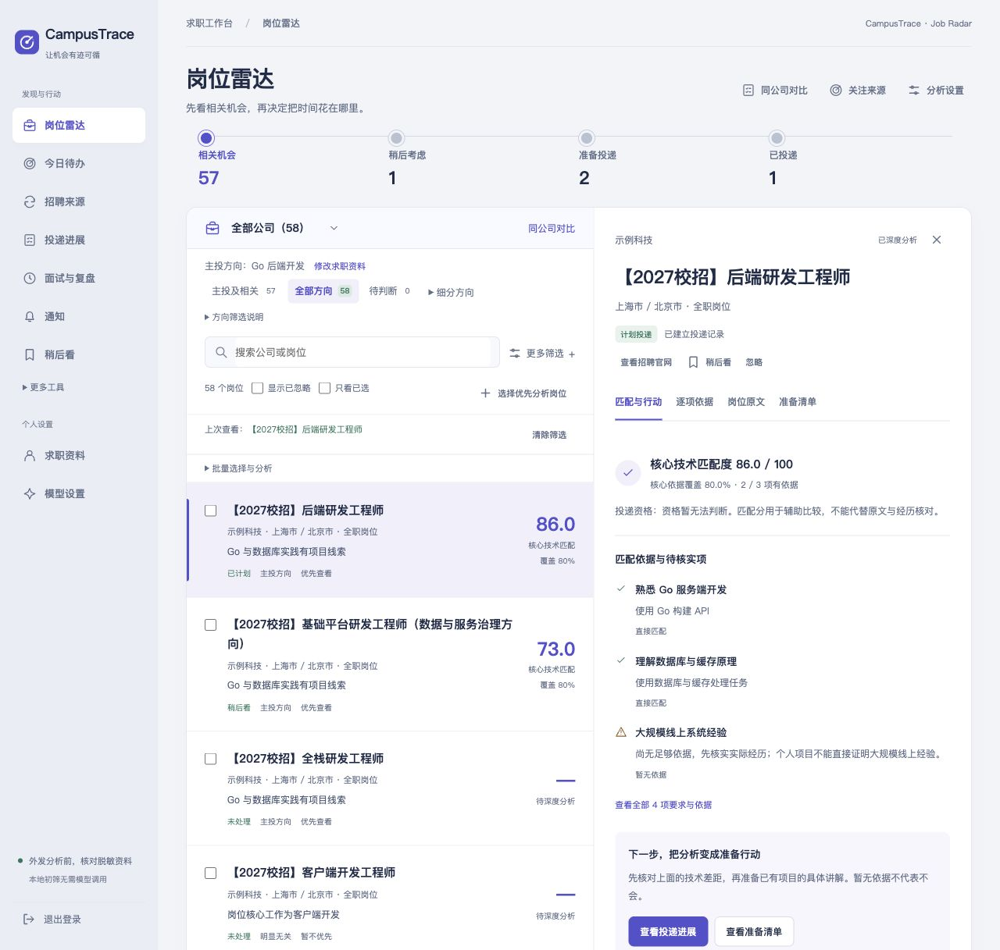

# CampusTrace

**你的校招小雷达：盯更新、挑岗位、记进度 (ง •̀_•́)ง**

**中文** | [English](README_EN.md)

开了一堆招聘网页，记不住哪家更新了岗位；同一家公司有十几个开发岗，却只让投一个；投完之后，又开始翻聊天记录找面试时间……

CampusTrace 就是为这些小麻烦做的。它是一个用 **Go** 写的个人求职工具，把招聘更新、简历资料、岗位匹配、投递和面试记录放在一起，帮你少翻几个网页、少漏几件事。

```text
关注招聘来源 → 本地筛选 → 挑选岗位深入分析 → 安排投递 → 面试与复盘
```

## 它能帮你做什么

| 你遇到的事 | CampusTrace 的做法 |
| --- | --- |
| 招聘网站太多，天天刷新很累 | 关注已适配的公司来源，后台定期检查新增岗位和变化 |
| 岗位堆成山，很多一看就不是我要投的 | 按主投方向、公司、城市筛选；明显无关的可以批量忽略，之后还能恢复 |
| 每次都得重新解释自己的学历和项目 | 在「求职资料」里统一维护，也可以从简历提取草稿 |
| 不知道项目和岗位要求对不对得上 | 先做不调用模型的本地初筛，再按需让模型逐项比较，附上岗位原文和项目依据 |
| 同公司只能投一个，选岗纠结 | 对比同公司的已分析岗位，看看各自的匹配依据、差距和待核实条件 |
| 投过什么、用哪版简历、面试到哪轮了 | 记录投递阶段、简历版本、面试安排和复盘；「今日待办」提醒下一步 |

匹配结果会区分「有依据」「部分匹配」「暂无依据」。**简历里没写，不等于你不会；资料不足时，先核对，而不是硬给一个分数。**



*截图使用虚构的公司、岗位和项目资料，仅展示界面。启动项目不会自动塞入样例岗位。*

## 先跑起来 ヾ(≧▽≦*)o

准备好 **Go 1.25.9+、Git，以及正在运行的 Docker（含 Compose）**。首次构建需要联网下载依赖和镜像。

```sh
git clone https://github.com/KanaDoodle/CampusTrace.git
cd CampusTrace
./campustrace start --open
```

等启动完成，打开 [http://127.0.0.1:8080](http://127.0.0.1:8080/)，注册自己的账号就可以开始用了。

一个入口会启动应用、MySQL、Redis、etcd 和两个 Analysis 实例，等待它们准备好。关掉终端后，服务仍然运行。平时可以用这些命令：

```sh
./campustrace status                # 看看服务有没有正常运行
./campustrace open                  # 打开网页
./campustrace logs api --tail 100    # 遇到问题时看看日志
./campustrace doctor                # 检查 Docker 和项目配置
./campustrace stop                  # 停应用，保留依赖和数据
./campustrace stop --all            # 依赖也停掉，数据卷仍然保留
./campustrace start                 # 下次继续用
./campustrace restart --build       # 源码更新后：先备份和构建，再重启
./campustrace backup                # 备份到本机 bin/backups/
```

CLI 使用固定的 `campustrace` Compose 项目名。备份和数据都留在本机；恢复方法见 [备份与恢复](docs/recovery.md)。本地配置放在不提交到 Git 的 `.env` 中，可以设置网页端口 `CAMPUS_HTTP_PORT`、`JWT_SECRET` 和服务器默认模型。部署到其他环境时，请设置独立的、至少 32 字节的 `JWT_SECRET`；默认配置用于本机使用。

## 第一次用，按这个顺序就好

### 1. 先告诉它，你想找什么

打开「**求职资料**」，填写学历、毕业届别、主投职能、城市偏好、语言和技术，再整理项目经历。

也可以点击「导入简历」，选择文字版 PDF、DOCX 或 TXT。文件先在浏览器本地读取，你检查并修改脱敏预览后，再确认交给模型整理。返回的条目**默认全部勾选**，可以改写或取消；点击保存后才进入求职资料。

本科和硕士会作为不同教育经历保留。你可以选择本轮校招使用哪段经历，避免把两个专业、两个毕业年份混在一起。项目内容也会区分「已实现」「已知局限」和「计划实现」，计划不会被当成已经做过的成果。

### 2. 把关注的公司加进来

在「**招聘来源**」里搜索公司，选择支持自动导入的来源，先预览范围，再设置关键词和检查间隔。后台会逐步导入，并按关注配置继续检查更新。

也可以点击顶部「**一键导入全部岗位**」，一次读取全部已适配来源的当前校招范围。导入在后台继续，刷新或离开页面后仍可查看进度；失败来源可单独重试，已有岗位会去重。这是一次性导入，不会改动已有关注设置，也不会自动调用大模型做深度分析。完整导入每 30 分钟可发起一次，目录中仅提供官网入口的来源不参与。

已有适配包括小红书、腾讯、百度、阿里巴巴、京东、哔哩哔哩等公司，也提供部分外企和制造业入口。**目录里有官网链接，不一定代表已经能自动抓取。** 每个来源的状态、招聘范围和验证记录见 [招聘来源清单](docs/campus-source-inventory.md)。

### 3. 先筛，再分析，别让模型钱包加班

在「**岗位雷达**」里先看主投及相关方向，再按公司、城市和状态缩小范围。本地初筛不调用模型；后端、服务端等常见名称会归一，语言要求的「任选一种」也会单独处理。它使用有限的规则和词表，复杂要求仍要看原文。

点开岗位，右侧就能查看匹配依据、原文和准备清单。需要深入比较时，勾选岗位后发起「深度分析」：**先检查完整外发资料，再确认开始**。默认每轮最多处理 30 个待分析岗位，成功结果会保存，失败项可以单独重试。

分析会复用已有结果。相同的岗位要求不用反复解析；技能和项目变化后会提示更新。分数只用来辅助比较，不能代替官网要求，也不是录用概率。

### 4. 比完岗位，把下一步记下来

在「同公司对比」里并排看已有分析。想继续准备，就加入投递计划，再从「准备清单」整理项目讲解和待核实项。对比和准备清单读取已有结果，不额外调用模型。

如果一家公司只允许投一个岗位，可以在「投递进展」维护同公司、同批次的限投规则；创建计划时会检查已占用的名额。规则需要你根据官网填写，实际投递仍由你在官网完成。

投递之后记录阶段、所用简历和备注；面试后补上结果与复盘。再打开「今日待办」，看看近期截止、面试、待复盘和分析失败项，求职进度就不用全靠脑内缓存啦。

## 模型怎么选？资料会发到哪里？

「**模型设置**」内置 OpenAI 和 DeepSeek 预设。填入自己的 API 密钥，再选模型即可；也可以使用部署者配置的服务器默认模型。

- **原始简历文件和原始文字不上传。** 简历导入只发送你确认过的脱敏预览；自动遮盖可能漏项，请检查姓名、联系方式及项目中的敏感文字。
- **保存后的求职资料和项目事实会写入 CampusTrace 的 MySQL。** 默认部署时，数据库在本机 Docker 中。
- **网页 API 密钥按账号保存在当前浏览器。** 本地存储未加密；调用时会经 CampusTrace 服务转发给对应模型提供商，不写入项目数据库。
- **API 调用会产生提供商费用。** 项目里的每日上限限制岗位匹配调用次数，不是整个模型账号的金额上限；失败或超时的请求也可能计费。

不想配置 API？本地筛选、投递记录和面试管理照常用。还可以批量选择岗位，点击「**导出到 ChatGPT**」，核对分析包后自行上传或粘贴到聊天中。这个导出操作不调用模型；聊天结果目前需要你自己阅读，尚不能自动回写项目。

## 求职问答里的 Agent 能做什么

在「更多工具 → 求职问答」里，可以问它岗位依据、项目经历、准备方向或分析任务的情况。它会调用项目允许的查询工具，读取你有权限访问的数据。

已有匹配结果可以直接查询，不会因为问一句问题就重新跑整批深度分析。涉及创建投递计划、修改关注等允许的写操作时，它先给出预览，**你点确认后才执行**。选用外部模型进行问答时，问题和相关工具资料会发送给该提供商。

未配置外部模型时，提供一个能力有限的离线路由器，方便查看工具流程。它不是完整的聊天大模型。

## 幕后怎么做的

这也是一个 Go 后端实践项目。除了页面上的功能，下面这些实现解决的是使用中实际会遇到的问题：

| 问题 | 实现 |
| --- | --- |
| 岗位更新要入库，还要可靠地安排后台处理 | MySQL 事务与 Outbox 记录任务，Redis Stream 分发，Worker 通过数据库幂等处理重复消息 |
| 网页关了，分析进度不能全丢 | MySQL 保存任务和逐项进度；服务中断后保留已完成结果，重新核对资料再继续 |
| 改了简历，旧分析不能冒充新结果 | 分开缓存岗位解析与个人匹配，核对输入版本，拦住过期执行的写入 |
| 一家公司最后一个投递名额，不能被并发占两次 | 同一事务检查限投规则、名额和记录版本 |
| 抓取和模型调用不能无限开 goroutine | 有界 Worker、独立并发限制、超时、限流、退避重试与失败队列 |
| 出了问题，要知道卡在哪一步 | 请求编号、任务阶段事件、Prometheus 指标，以及可复现的性能测量 |
| 分析服务需要独立运行 | 使用 [KanaRPC-Go](https://github.com/KanaDoodle/KanaRPC-Go) 的公开接口，配合 etcd 发现两个 Analysis 实例 |

招聘观察链路把「抓到了什么」「原文依据是什么」「规则如何判断」分开保存。页面还能访问，不会仅凭这一点就说岗位仍开放；已有投递也不会因为岗位关闭而自动终止。

## 开发与测试

默认把应用和依赖一起放进 Docker。如果要修改后端并在本机运行：

```sh
./campustrace stop
make deps
make dev-run
# 结束本机开发服务
make dev-stop
```

普通检查不需要模型密钥；前端测试需要 Node.js。

```sh
export GOWORK=off
go build ./...
go vet ./...
go test -count=1 ./...
go test -race -count=1 ./internal/...
node --test web/*.test.cjs
make verify-boundary
```

真实依赖集成测试用 `RADAR_RACE=1 ./scripts/verify-radar.sh`，会建立隔离测试库；Agent 评测用 `make eval`，默认使用合成问题与脚本模型，不产生外部模型费用。性能数据是测试场景的测量结果，具体条件见 [性能验证](docs/performance.md)。

## 想看更多细节

| 文档 | 内容 |
| --- | --- |
| [岗位匹配与求职资料](docs/matching.md) | 初筛规则、简历导入、引用核对、评分、缓存与批量分析 |
| [架构与处理链路](docs/architecture.md) | 原文与证据、队列恢复、RPC、Agent / RAG / MCP、版本与容量限制 |
| [后端升级说明](docs/backend-upgrade.md) | 持久分析任务、限投事务、缓存依赖与招聘源检查频率 |
| [招聘来源清单](docs/campus-source-inventory.md) | 公司入口、已适配范围、验证记录与接入限制 |
| [来源适配说明](docs/campus-sources.md) | 公开接口、分页和抓取约束 |
| [接口文档](docs/api.md) | HTTP API 与维护命令 |
| [监控与排障](docs/operations.md) | 指标、失败阶段与请求编号 |
| [备份与恢复](docs/recovery.md) | 备份验证、隔离恢复与历史清理 |
| [Agent 评测](docs/agent-evaluation.md) | 评测题集、运行时检查与结果说明 |

## 目前还没学会的事 (´・ω・`)

招聘网站改版、接口限制或网络问题都可能影响导入；没有适配的公司需要手动查看。扫描版简历暂不支持 OCR，复杂岗位语义和模型推断也仍需要人工核对。

项目定位是个人求职工具：不提供自动投递，通知目前以站内提醒为主，准备清单勾选不跨设备同步。更多容量、认证和运维限制见 [架构说明](docs/architecture.md#当前限制)。

遇到不好用的地方，欢迎提 Issue。带上操作步骤和脱敏后的错误提示就很有帮助；真实简历、API 密钥和数据库备份请留在自己手里。

许可证：[AGPL v3](LICENSE)。上游来源与依赖许可见 [依赖说明](docs/dependency-audit.md)；KanaRPC-Go 保留了 KamaRPC-Go 的来源和历史。
