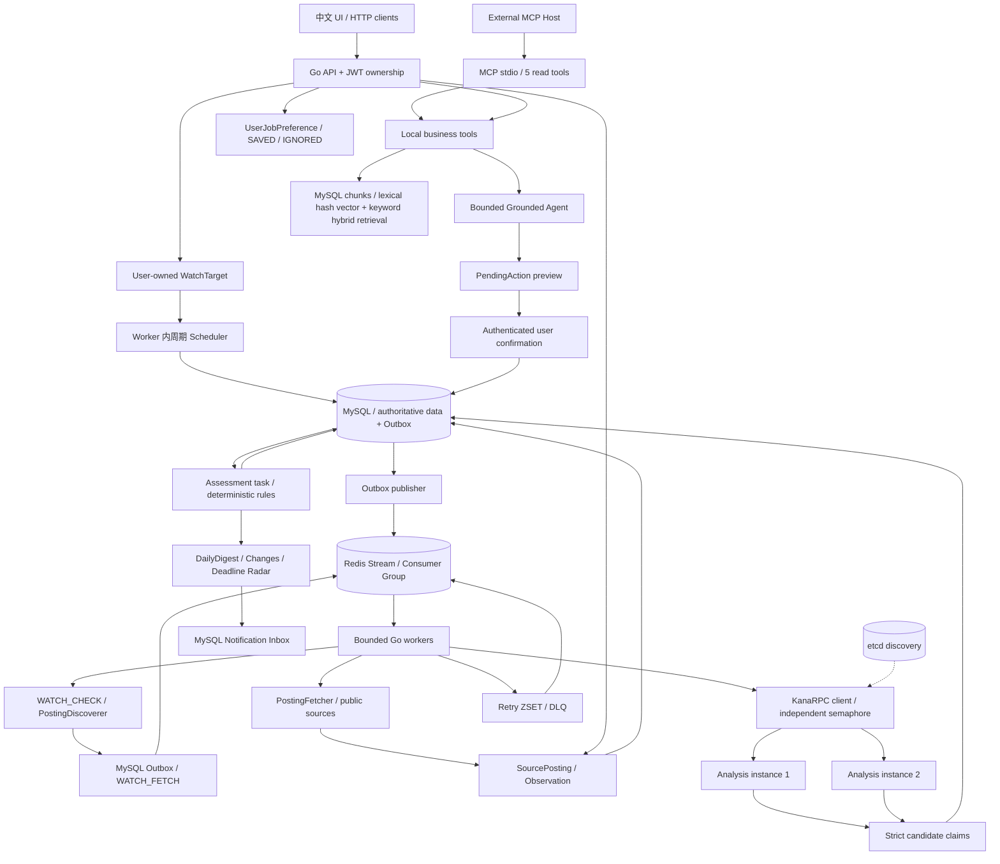

# CampusTrace

**中文** | [English](README_EN.md)

**持续监控招聘来源的校招 Job Radar 与可信求职工作流**

*Evidence-first campus recruiting workflow backend built in Go.*

> 招聘页面仍然可以访问，并不代表岗位仍然开放；
>
> 大模型认为你符合要求，也不意味着这个结论有可靠依据。

CampusTrace 用 Go 将岗位观察、证据核验、校招资格判断、投递记录和面试复盘串成一条可追溯的工作流。它关注的不只是“给出答案”，而是**观察到了什么、什么时候观察到、结论依据是什么，以及哪些地方仍然不知道**。

这是使用 synthetic demo data 展示的学习与工程实践项目。它不会自动投递岗位、编造个人经历，也不以演示数据代表实际用户规模或线上效果。

## CampusTrace 是什么

CampusTrace 持续监控用户关注的招聘来源，自动发现新增岗位、状态变化和截止变化，并基于可信岗位数据形成每日 Job Radar 与行动工作流。你也可以手动导入岗位，结合个人资料核对 Eligibility，分别查看 GoFit 和投递优先级，再记录投递、面试与复盘。Grounded Agent 使用受约束的业务工具查询这些信息；涉及写入时，先给出预览，再由用户明确确认。

面向求职者，它帮助区分“岗位是否开放”“我是否符合要求”“是否值得优先投递”；面向 Go 后端面试官和 GitHub 开发者，它展示一套围绕真实业务约束实现的事务、异步处理、RPC 服务治理与 Agent 工具执行边界。

## 为什么做这个项目

校招信息常常存在几个不同的问题：页面还在，但投递入口已经关闭；岗位描述没有写清毕业年份；第三方转载与官方信息矛盾；模型给出了肯定答案，却没有可核对的出处。

CampusTrace 将这些问题拆开处理：来源可信度需要明确登记，信息变化需要保留历史，资格判断需要规则和证据，偏好评分不能冒充硬性资格，模型输出也不能直接成为事实。

## 核心思想：Observation → Evidence → Assessment

```text
Source → Observation → Evidence → Deterministic Rules → Assessment
```

| 层次 | 保存什么 | 如何约束结论 |
| --- | --- | --- |
| Observation | 一次实际观察的原始输入、时间和抓取结果 | 输入不可变，提取处理状态可独立推进；新的失败不会被旧的成功掩盖 |
| Evidence | 来源 Observation、原文或规范化摘录、提取方法和置信度 | 候选 claims 必须经过严格解码、摘录绑定与保守信号验证，才能持久化 |
| Assessment | 基于当前输入与确定性规则生成的判断 | 保留追加历史，区分确定结论、冲突、待核验与未知 |

近期官方投递证据且没有关闭信号，才允许判断 `OPEN`；明确官方关闭或截止时间已过，可以判断 `CLOSED`。信息不足、相互矛盾或仅有第三方证据需要核验；官方观察失败或过期会产生 `UNKNOWN`。**HTTP 200 本身不是开放证据。**

岗位状态、Eligibility、GoFit、偏好排名和投递状态相互独立。岗位关闭不会自动终止已经进行中的投递。

## UI Screenshots

当前公开仓库尚未包含可引用的 UI 截图，因此此处不展示占位图或仓库外审计图片。可按下方 Quick Start 启动中文界面，重点查看**岗位详情、Evidence Timeline、Eligibility 和求职助手**；具体演示步骤见 [Demo](#demo)。

## Architecture


```mermaid
flowchart TD
  UI[中文 UI / HTTP clients] --> API[Go API + JWT ownership]
  Host[External MCP Host] --> MCP[MCP stdio / 5 read tools]
  MCP --> Tools[Local business tools]
  API --> Tools
  API --> Watch[User-owned WatchTarget]
  Watch --> Scheduler[Worker 内周期 Scheduler]
  Scheduler --> DB
  Worker --> Discover[WATCH_CHECK / PostingDiscoverer]
  Discover --> Fanout[MySQL Outbox / WATCH_FETCH]
  Fanout --> Stream
  Worker --> Fetch[PostingFetcher / public sources]
  Fetch --> O[SourcePosting / Observation]
  API --> O
  Rules --> Radar[DailyDigest / Changes / Deadline Radar]
  Radar --> Inbox[MySQL Notification Inbox]
  API --> Preference[UserJobPreference / SAVED / IGNORED]
  O --> DB[(MySQL / authoritative data + Outbox)]
  DB --> Publisher[Outbox publisher]
  Publisher --> Stream[(Redis Stream / Consumer Group)]
  Stream --> Worker[Bounded Go workers]
  Worker --> RPC[KanaRPC client / independent semaphore]
  Etcd[(etcd discovery)] -.-> RPC
  RPC --> A1[Analysis instance 1]
  RPC --> A2[Analysis instance 2]
  A1 --> Claims[Strict candidate claims]
  A2 --> Claims
  Claims --> DB
  DB --> Rules[Assessment task / deterministic rules]
  Rules --> DB
  Worker --> Retry[Retry ZSET / DLQ]
  Retry --> Stream
  Tools --> Agent[Bounded Grounded Agent]
  Agent --> Pending[PendingAction preview]
  Pending --> Confirm[Authenticated user confirmation]
  Confirm --> DB
  Tools --> RAG[MySQL chunks / lexical hash vector + keyword hybrid retrieval]
```

MySQL 事务与唯一约束承担业务正确性；Redis 承担队列、重试、限流、缓存及短期 Agent 状态。**Analysis 是唯一远程业务服务**：它通过 KanaRPC 返回候选 claims，主后端保留决策与 CRUD 职责。

## Core Features

### 岗位来源、归并与变化记录

- 来源为运营者登记的 `OFFICIAL`、`THIRD_PARTY` 或 `MANUAL`；可信度不是系统自动认证的。公共 API 导入只能创建用户自有的 `PRIVATE` manual source，不能自行赋予官方可信度。官方/系统来源为 `GLOBAL`，私人观察不会并入共享岗位库。
- 一个 canonical Job 可以对应多个 SourcePosting。先按来源与 external ID 匹配，再按来源内 URL 确定 posting 身份；结构化摘要仅用于寻找跨来源候选，还需核对公司、规范化标题、岗位类型、地点集合与来源身份。归并依据保存在 posting JSON 中，不做模糊或 LLM 归并。
- External ID、URL path/query 保留大小写，内容按精确字节处理。不确定的候选保持分离；没有稳定 external ID/URL 的手工文本发生变化时，可能形成新岗位。
- 连续成功观察的内容 hash 用于记录内容与结构化变化；每个 posting 取最新观察。Worker 每小时用已有观察重新评估 freshness，状态缓存最多可能滞后一小时，该 freshness 任务只重算已有观察；启用 WatchTarget 后，独立的周期检查会自动发现并重新抓取岗位。

### Eligibility、GoFit 与投递优先级

Eligibility 分别检查毕业年份、学历、岗位类型、地点、经验、专业、语言和技术要求。毕业年份、学历或岗位类型缺少证据时属于关键 `UNKNOWN`；明确硬性不符优先，未解决的证据问题优先于偏好条件。

地点和偏好岗位类型属于 `CONDITIONAL` 偏好，不伪装成硬性资格约束。已识别的专业、语言和经验要求可以成为硬约束；可选技术信号不能覆盖明确的 `REQUIRED:` 条件。

投递条件核对中的「我的情况」始终来自已保存的求职资料，不依赖岗位要求是否提取成功。地点展示首选与可接受城市，毕业届别支持年份范围。岗位侧缺少证据时显示「尚未提取到明确要求」，个人侧确实为空时显示「求职资料中尚未填写」；缺少岗位证据仍保留 `UNKNOWN`，不会仅凭资料完整就判为满足。

GoFit 独立输出 `EXPLICIT_GO`、`LANGUAGE_FLEXIBLE`、`NO_GO_SIGNAL`、`CONFLICTING` 或 `UNKNOWN`。Ranking 使用可见的加权分解，通过 `RANKING_WEIGHTS` 配置全部权重；`breakdown_sources` 区分证据判断、用户偏好和岗位/观察元数据。

离线 parser 仅保守支持 [导入示例](testdata/import.json) 中的显式标签，以及常见的 `2027届`、`本科及以上`、Go/Golang 和投递/关闭文本，不代表通用自然语言提取能力。

### 求职资料与简历草稿

在网页的「求职资料」中维护毕业届别、学历、专业、求职意向、技能与语言；同一页可新建项目、手动添加或修改项目事实。项目事实必须区分「已实现」「已知局限」「计划实现」，并由用户自己勾选核对状态。只有已核对的「已实现」事实可作为已完成成果供 Agent 使用。

可选择不超过 5 MB 的文字版 PDF、DOCX 或 TXT 简历。浏览器在本地提取文字，遮盖带标签的姓名、常见手机格式（含空格、短横线和 `+86` 前缀）、邮箱、身份标签和链接，随后显示**完整外发文字**供用户继续修改。无标签姓名可在页面输入后仅在本地遮盖；该输入不会保存或发给服务端。自动遮盖无法保证识别所有姓名、地址或其他敏感信息，因此必须逐行检查；只有勾选确认并点击「让模型生成草稿」，这段预览文字才会发到后端并转发给所配置的外部模型。原始简历文件和原始文字不上传，也不在服务端存储。扫描版 PDF 暂不支持 OCR。

模型只返回带有简历原文摘录的资料建议与项目事实草稿。技术技能建议以独立的技术、框架、工具或简历明确写出的较宽泛能力为单位；`goroutine`、`sync.Mutex` 等 Go 实现细节会从技能建议中过滤，但可以保留在项目事实中。所有建议默认不勾选，现有值并排展示；用户可修改后选择保存。项目事实默认未核对，重复导入会显示现有资料并复用同名项目、跳过完全相同的事实。已确认的匹配字段与项目事实仍按现有架构保存在 MySQL。只有未设置服务器默认模型、也未在「模型设置」中选用模型时，草稿按钮才不可用；手动维护功能照常使用。确认的资料可用于下面的岗位语义匹配；技能名称本身不代表实际熟练程度。

「模型设置」内置 GPT-6 Luna、GPT-6 Sol、DeepSeek Flash 和 DeepSeek V4 Pro 预设。用户只需填写 OpenAI 或 DeepSeek 的 API 密钥，再选用模型；接口地址和模型标识由项目固定维护，同一提供商的密钥可供它的多个预设使用。也可切回服务器默认模型。网页密钥按登录账号保存在**当前浏览器的本地存储**，刷新或退出登录后重新登录仍可使用，也可在页面主动删除；不会写入 CampusTrace 数据库。浏览器本地存储不是加密保险箱，同一设备上能访问此浏览器资料的人可能读到密钥，因此只应在可信设备的本机页面或 HTTPS 部署上填写。每次调用时，密钥会由浏览器发送给 CampusTrace 服务，再由服务发送给所选提供商。求职问答会将问题和相关工具资料发送给所选提供商，切换模型时使用独立会话。DeepSeek 的公开 Chat Completions 接口会关闭默认思考模式，简历草稿还会请求 JSON 输出；简历调用最多等待 90 秒，超时、密钥、余额和摘录核对失败会显示不同原因。

浏览器解析使用随仓库打包的 [PDF.js](https://mozilla.github.io/pdf.js/) 和 [JSZip](https://stuk.github.io/jszip/)，不依赖运行时 CDN；版本和许可文件位于 `web/vendor/`。

### 岗位匹配：初筛、按需分析与缓存

「岗位匹配」对当前账号可见的全部岗位进行本地初筛（显式容量上限 10,000 条，与普通搜索的 100 条及 Radar 的 500 条容量分别计算），每页展示 50 条。点击岗位名称，或进入岗位详情，可查看逐项初筛依据。支持按公司、岗位名称或识别出的方向、分析状态和四档初筛建议筛选。

初筛结合标题与职责识别方向：后端、服务端等名称归一，标题笼统时可由服务接口与存储/异步处理职责提供后端线索；基础架构/平台作为相关方向，明确指向其他职能的标题不会被正文线索覆盖。按段落和语句分开必需项、工作内容与加分项，语言“任选一种”和“同时掌握”分别核对；Go 不会误命中 Google，别名和重复技能不重复计分。只有已确认 IMPLEMENTED 事实的正向文字参与项目依据，PLANNED、LIMITATION、未确认事实及否定文字均不用于证明能力；Redis 等组件不会推导出未记录的并发能力。

优先级由方向最高 30 分、城市与岗位类型偏好 20 分、技术线索 30 分、项目实现依据 20 分组成；技术与项目线索按必需项 3、职责 2、加分项 1 计权，“任一”满足一项即可，“全部”按命中比例计算。优先城市计 12 分、可接受城市计 8 分，类型偏好计 8 分。四档为「优先查看」「可能相关」「信息不足」「暂不优先」；缺少明确技术要求时保留信息不足，暂无资料依据不等于不会。只有无歧义的最低学历或毕业年份不符才排除自动分析，冲突、优先学历、毕业月份及解析不完整时留待核对；城市偏好不作硬性排除。更新时间单独显示，仅用于同分排序。此分数是本地规则优先级，不是模型能力匹配度或录用概率。

本地解析使用有限的显式技术词表与职责线索，无法完整理解所有行业术语、复杂语言组合或语义关系；页面展示岗位原文和资料摘录供复核。每段最多解析 600 bytes、技术要求最多 48 组、职责线索最多 64 段、资格最多 16 条，超出范围会提示解析不完整。按脱敏岗位全文与独立本地版本缓存解析，进程内上限 10,000 条/32 MiB 估算内存预算；个人依据每次读取当前账号资料，不共享候选人的匹配结果。不调用外部模型、不使用调用额度，也不使已保存的模型分析因本地规则升级而失效。

默认每轮分析前 30 个待分析岗位，按顺序执行。每轮范围 1—100 个，每日岗位匹配调用尝试上限默认 40 次、可设置 1—200 次，按北京时间每日重置；这不是所有简历或 Agent 调用的总预算，也不是金额硬上限。

前端复用「模型设置」中的模型和本机密钥。先展示本轮外发的结构化资料，勾选核对后才可开始模型分析。仅发送资格、技能、语言、意向职能及已确认的 IMPLEMENTED / LIMITATION 事实；未确认事实、PLANNED、原始简历、账号信息、项目名称和引用链接不发送。常见直接标识自动遮盖，补充姓名输入只用于 CampusTrace 服务本轮脱敏，不写数据库或日志，不发送给模型；部署在远程机器时，该本轮输入会经该服务处理，不能把远程部署视为纯本机。脱敏预览仍需要人工检查。密钥只随本次请求临时使用，不进入队列、缓存、进度或数据库。

要求解析与个人比较分别调用模型，分别缓存。每批最多 3 个岗位、招聘文字合计不超过 24,000 bytes，比较阶段再按最多 24 条要求分组，限制输入和输出量。相同脱敏 JD 按账号、文字、模型和匹配版本复用解析；个人比较还绑定资料 revision 与已确认事实摘要。重复同步同一文字不触发重算；修改资料或事实只重做个人比较，岗位、模型或匹配版本改变则相应结果显示「待更新」。同账号 Redis lease 防止多页并发重复付费，MySQL 原子检查每日调用上限；失败或超时的尝试也计入，不自动重试外部模型。已完成的小组及要求解析会保存，支持暂停、刷新后续跑和失败项单独重试。

模型必须逐项返回岗位原文摘录和候选人事实引用，不能将 ROLE 或 LIMITATION 当作能力证明。程序拒绝跨岗位摘录、不存在的引用、漏项、重复项及无依据的肯定或否定。能力匹配按 REQUIRED=3、RESPONSIBILITY=2、BONUS=1 加权，DIRECT=1、PARTIAL=0.5、TRANSFERABLE=0.25、MISMATCH=0；NO_EVIDENCE 降低依据覆盖度，不宣称候选人不会。对有依据的条目计算分数，覆盖低于 60% 时不显示数字，QUALIFICATION 单独核对。模型的语义对应仍需人工核实；引用存在不等于语义推断必然正确，也不代表录用概率或招聘状态。

「自动分析新增或变化岗位」仅在岗位匹配页面开启、当前外发资料已核对且额度允许时运行，每分钟检查一次。不在初次打开时把历史库存全部发送，关闭或离开页面停止后续批次；刷新后先核对资料，可继续保留的未完成批次。尚无关闭页面后的本机密钥托管。OpenAI API 独立按 API 价格计费，不消耗 Codex 订阅额度。

岗位列表支持逐条勾选、选择本页、选择全部筛选结果及选择前 N 个待分析岗位。选择以岗位编号在当前浏览器 sessionStorage 中按账号保存，跨页、切换筛选条件和刷新时保留；刷新会移除已无法访问的岗位。点击「查看全部已选岗位」可以分页核对和移除。对已选岗位调用 API 时仍按每轮上限、缓存和每日调用预算执行；超过一轮的选择保留供下一轮处理。

也可点击「准备 ChatGPT 分析包」：不需要模型密钥、不调用外部模型，仅从当前账号的本地服务读取脱敏资料与所选岗位最新成功原文。导出包含已确认的资料事实、城市/岗位类型偏好、岗位编号、名称、公司、地点、招聘状态和本地提醒；不包含账号、简历文件、项目名/引用链接或 API 密钥。元数据和偏好也做标识遮盖。每次最多 1,000 个岗位、5 MB；最近原文缺失时明确拒绝，不自动使用旧观察。资料变更须重新准备。补充姓名仍只用于服务本轮脱敏，远程部署时会经远程服务处理。

完整导出文字在浏览器展示并可编辑，确认全部分析包后才可下载或复制。按公司尽量归入同一包，再按每包最多 8 个岗位、约 48 KB UTF-8 完整文字分包（包括重复资料和统一指令）；过长的单个岗位保留完整原文并独立成包。单包下载 Markdown，多包下载 ZIP，并附使用说明与汇总指令。用户自行上传/粘贴到 ChatGPT，按统一证据标准分析；导出不消耗 API 额度，聊天使用所选平台的套餐额度。**本版聊天结果尚不自动导入 CampusTrace，也不覆盖项目内 API 分析结果。**

### 投递、面试与准备上下文

投递按 `PLANNED → APPLIED → OA / INTERVIEW → HR / OFFER` 及允许的拒绝/撤回路径流转。一次状态变更在同一个 MySQL 事务中锁定并验证当前状态、校验 expected version、插入事件并更新记录；1.0 不支持重新打开终态投递。

面试和复盘归属于对应投递的用户。复盘为追加记录，每次面试一份；经验证的显式薄弱知识点累积次数、严重程度、首次/最近出现时间与复盘引用。准备上下文使用与 Eligibility/GoFit 相同的输入快照，展示 `current_requirements`、`current_observations`、已核验项目事实及限制、薄弱知识点和检索知识，不混入历史要求。准备优先级目前为严重程度 × 出现次数。

## Job Radar v0.2

首页提供今日新增、优先投递、7 天内截止、状态变化和未来 7 天面试；“稍后看 / 忽略”使用独立的 UserJobPreference，“准备投递 / 已投递”复用原 Application FSM。Agent 的四个雷达 read tools 只读当前事实，`watch_source` / `unwatch_source` 仍需要 Proposal → PendingAction → 显式确认 → MySQL receipt。

调度与来源链：

```text
WatchTarget (MySQL next_check_at)
  → SELECT due FOR UPDATE SKIP LOCKED
  → 同事务 schedule_version++ / next_check_at / Outbox(WATCH_CHECK)
  → Redis Stream → Worker → Discover
  → 同事务 fan-out Outbox(WATCH_FETCH) + discovery receipt
  → Redis Stream → bounded Fetch / existing source Lua rate limit
  → 锁定并重验 Watch generation → existing Ingest + per-posting SQL receipt
  → Observation → KanaRPC Analysis → Evidence → Rules → Assessment
  → Radar read models / idempotent Notification Inbox
```

抓取子任务共享现有 Stream，每个岗位独立 timeout/retry；来源不增加服务或 RPC 边界。重复投递会收敛到同一 Observation；更改设置、暂停或删除后，旧 generation 不再写观察或调度状态。来源 429 至少等待一分钟再重试，5xx/timeout 使用已有 backoff，401/403/格式不兼容为本次任务的永久失败。访问失败、列表中消失或 HTTP 200 都不能直接决定 CLOSED/OPEN。

`make seed` 会登记以下三个公开平台的示例企业，但不会替用户启用关注。来源可信度仍由维护者登记；平台上的全职岗位不自动等于校招岗位。

| Adapter | 示例 tenant | 验证级别（2026-09-14） | 实际验证范围 |
| --- | --- | --- | --- |
| Lever | `weride` | IMPLEMENTED / FIXTURE TESTED / LIVE VERIFIED | 最终验证发现 17 个发布；抓取中国 New Grads 岗位并写入 Observation |
| Greenhouse | `pingcap` | IMPLEMENTED / FIXTURE TESTED / LIVE VERIFIED | 发现 10 个发布；抓取东京岗位并写入 Observation，未宣称中国应届覆盖 |
| SmartRecruiters | `Ubisoft2` | IMPLEMENTED / FIXTURE TESTED / LIVE VERIFIED | 发现 293 个发布；抓取上海岗位并写入 Observation，未宣称该样本是应届岗位 |

平台接口依据：[Lever public Postings API](https://github.com/lever/postings-api)、[Greenhouse Job Board API](https://docs.greenhouse.io/job-board.html)、[SmartRecruiters Posting endpoints](https://developers.smartrecruiters.com/docs/endpoints)。上述实时计数是一次验证快照，不保证未来来源数量与可用性。

登记其他企业（仅维护者本地操作）：

```sh
go run ./cmd/ingest -register-source -source company-radar -name 'Company' \
  -type OFFICIAL -trust OFFICIAL -adapter lever -tenant COMPANY_TENANT -rate 30
```

用户在“关注源”可以粘贴 `https://job.xiaohongshu.com/campus/position`，先预览当前校招项目、岗位总数与样例，再选全部/研发/算法/非技术方向、可选标题或地点关键词，以及 30 分钟～7 天检查间隔。创建后在“我的关注”查看进度和“已导入岗位”分页列表，点岗位可查看原有证据、资格与评分。预览只读，不创建关注；首次导入由后台逐步完成。网页输入的网址会严格限定为已适配的小红书列表页，不能任意抓取其他域名或自动推断其他公司的接口。该用户自建来源为私有 `MANUAL`，系统不会仅因网址属于企业网站就自动赋予 `OFFICIAL` 可信度。

其他已登记 Source 仍可在折叠区选择。用户可设置标题/地点关键词和检查间隔；来源地址由维护者登记的 adapter + tenant 确定。更换 Source 需另建关注。旧版手动 URL 导入保持可用。小红书适配器通过其公开招聘接口获取项目、分页列表与岗位详情；网页本身为 JavaScript 应用，不能只抓初始 HTML。公开请求会复用连接，并在核验整个 DNS 答案后尝试其中的其他公开地址；只读查询遇到网络错误或 5xx 时最多重试一次，访问拒绝或限流不立即重试。预览错误区分网络连接、网站繁忙、访问限制和数据格式变化。接口、招聘项目或网页结构改变时会明确报错，不会把不完整列表视为抓取成功。来源本地限速会延后任务，不消耗抓取失败的重试额度。

新 migration `004_job_radar.sql` 增加 Watch、抓取 receipt/进度、Preference 和 Notification 表；`make seed` 执行迁移。升级前停止旧 Worker，再迁移并启动新 API/Worker；旧 Worker 不识别新 task type，不能混跑消费同一队列。

容量与展示：每个用户最多 100 个 Watch，每个 Watch 最多 500 个已发现/历史 posting；响应解压后最多 1 MiB，岗位正文最多 60,000 bytes。完整 Radar 聚合最多 500 个可见 Job、500 个未完成 Interview、10,000 个窗口内 change，超限明确返回 `RADAR_CAPACITY`；不提供无界扫描。摘要计数完整，岗位各展示前 5 条、变化/面试各前 10 条，并标明 `truncated`。变化 feed 和 Inbox 最近 100 条，尚未提供历史翻页。最近窗口为滚动 24h/7d，截止窗口为滚动 3/7/14 天。

推荐要求当前 OPEN、ELIGIBLE/CONDITIONAL、尚未投递或仅 PLANNED、未忽略；按现有规则评分降序及 Job ID 排序，使用与原 evaluation CAS 相同的计算函数。新岗位分数 ≥70 才发优先提醒。截止提醒以“deadline 语义版本 + D7/D3/D1”去重，进入当前最紧窗口时发一次；同一截止值连续重抓不重复，修改再改回也形成新版本。状态变化引用现有 Assessment 历史，内容/截止变化引用 JobChange；Notification 不承担 Job truth。通知后台每分钟轮转处理 10 个用户，仅站内提醒。

真实外网验证独立启用，不纳入普通 CI：

```sh
# MYSQL_TEST_DSN 指向独立测试库；需要 Compose 依赖
CAMPUS_INTEGRATION=1 CAMPUS_LIVE_SOURCES=1 GOWORK=off \
  go test -count=1 -run TestRadarLiveSources -v ./internal/integration
```

详细变更与验收见 [PRODUCTIZATION_REPORT.md](PRODUCTIZATION_REPORT.md)。

## Reliable Async Pipeline

```text
MySQL Outbox → Redis Stream → Worker → KanaRPC Analysis
                                      ↓
                             Evidence → Assessment
```

整体采用 **at-least-once** 投递。Outbox 在崩溃后可能重复发布，业务结果通过数据库幂等收敛；SQL analysis result 与已完成 Assessment task key 是正确性边界。

- 同一个 Stream 承载 `WATCH_CHECK`、`WATCH_FETCH`、`ANALYZE` 和 `ASSESS` envelope。Worker 使用固定池，RPC 有独立 semaphore；模型和 embedding 工作另有可配置并发上限，不意味着默认使用外部 embedding 服务。
- PEL 通过 `XAUTOCLAIM` 恢复，idle time 大于任务 deadline。恢复在有界轮次间保留 stream/group cursor，每轮最多 32 次命令；每个串行 worker 只为一个空闲槽 claim 一条消息。任务执行超过 claim idle timeout 时仍可能再次被 claim，没有 fencing 或 lease renewal。
- 临时失败按 2s、4s、8s 等指数退避并加入 jitter。Lua 将 retry/DLQ 状态记录与 ACK 放在同一操作中；另一个脚本将到期 retry 原子转回 Stream。永久 schema/auth/validation 错误直接进入 DLQ。终态分析失败写入 MySQL，并重新评估为未知。
- 测试覆盖数据库已提交、ACK 前崩溃的场景。异常 envelope 被保存为净化后的 DLQ 记录；`poison` hash 保留有界诊断、digest、时间、consumer 与可恢复的关联 ID，不保留完整畸形原始 payload。隔离失败则继续留在 PEL。
- 失败转移先检查 Redis key 类型/group，写 retry/DLQ 后写 v2 completion marker，最后 ACK。Lua 运行时错误不会回滚已发生的写入，因此使用稳定转移字节支持重跑，不信任旧的提前完成 marker。

DLQ 由本地 operator CLI 查看和主动 redrive：

```sh
go run ./cmd/dlq
go run ./cmd/dlq -redrive TASK_ID
```

滑动窗口限流使用 Redis server time 和原子 ZSET/Lua，包含来源独立 key 及全局 LLM/embedding key。当前使用 standalone Redis，多 key Lua 不支持 Redis Cluster slot 分布。Stream、完成任务和 Outbox 历史需要人工保留策略，尚无自动归档。

## KanaRPC Integration

KanaRPC 是本项目维护者基于上游 KamaRPC-Go 历史持续实现与维护的**自研轻量 RPC / 服务治理框架**，属于学习与工程实践项目；来源与许可见 [KanaRPC 仓库](https://github.com/KanaDoodle/KanaRPC-Go) 和 [dependency audit](docs/dependency-audit.md)。CampusTrace Analysis Service 是它的真实业务消费者。

CampusTrace 是独立 module `github.com/KanaDoodle/CampusTrace`，固定依赖已发布的 `github.com/KanaDoodle/KanaRPC-Go v0.1.0`，仅导入公开的 `/rpc` facade。`go.mod` 无 replace，正常构建使用 `GOWORK=off`，无需 sibling checkout。Transport、codec、pool 与 breaker 实现类型留在 KanaRPC internal 内。v0.x facade 尚不承诺长期 API 稳定性。

两个 Analysis 实例注册到 etcd。已知 breaker-open 实例在负载均衡前被排除；admission race 下每个已发现地址最多尝试一次选择，远程业务方法不自动重放。本地取消不计入 breaker 失败，后端 deadline 仍计入。

KeepAlive/lease 丢失会降低 readiness，并以有上限的指数退避和 jitter 创建新 lease、恢复注册。`/healthz`、`/readyz` 使用 `ANALYSIS_HEALTH_ADDR`，本地两实例默认为 `127.0.0.1:19191` / `19192`；测试包含真实 lease revoke 与关闭 KeepAlive channel。

RPC wire protocol 没有提前远程取消信号；CampusTrace 传递显式 deadline 和 IDs，服务端工作到 deadline 或服务关闭时停止。这些实现边界不构成对成熟生产级 RPC 框架的性能或能力优势声明。

可选本地联合开发使用 `make dev-workspace` 生成 ignored `go.work`。`make verify-boundary` 在关闭 workspace 后验证已发布依赖边界，不能替代远程 clean clone 验收。

## Grounded Agent / RAG / MCP

### Grounded Agent：模型选工具，事实来自成功的工具观察

默认 `DemoModel` 是确定性的离线自然语言路由器；可在网页「模型设置」中选择外部模型，或由部署者通过 `LLM_URL`、`LLM_API_KEY`、`LLM_MODEL` 提供服务器默认的 OpenAI-compatible chat endpoint。普通测试使用 scripted models，不需要外部凭据。

默认预算最多 4 次模型调用、8 次工具执行，总 deadline 35s、单工具 timeout 8s，时间限制可配置。运行时校验未知字段、尾随 JSON、null、必填项、枚举、范围和大小；最后一步提案只记录 trace，不执行。

最终业务事实由成功的工具 observations 确定性渲染，**模型自由文本不会直接作为事实答案展示**。项目事实标记为 `IMPLEMENTED` / `LIMITATION` / `PLANNED`，只有已核验事实支持能力声明；检索内容中的指令不能任意调用工具或绕过确认。

写工具只保存归属用户、TTL 10 分钟的 PendingAction。`POST /agent/actions/{id}/confirm` 必须携带 `{"confirm":true}`，随后重新验证当前状态和版本。已完成的 MySQL receipt 按 action ID 与认证用户读取，即使 Redis pending 数据缺失或不可用，仍能重放完成结果；未完成时照常校验 owner/TTL/状态/版本，并区分数据不存在与后端错误。并发或重复确认通过数据库 receipt 幂等处理，模型没有确认工具。

会话按用户和 session 隔离，最多 6 个完整 turn / 32KB，TTL 30 分钟并带乐观版本检查；过期的并发 writer 可能跳过保存。失败 trace 净化后保留 24 小时，Redis 故障可能导致 trace 无法持久化。会话内容不属于业务 Evidence。

输出预算默认为：`AGENT_MAX_TOOL_RESULT_BYTES=32768`、`AGENT_MAX_FACTS_BYTES=98304`、`AGENT_MAX_ANSWER_BYTES=32768`、`AGENT_MAX_FINAL_BYTES=163840`。非正值回到默认；final 最小有效预算为 512 bytes，包含 JSON 与 SSE framing。超限工具结果不进入 Facts，无法容纳的输出以 `OUTPUT_LIMIT` 结束，不伪装成完整答案。同一步重复 call ID 只执行一次；验证后的相同规范化参数复用首次结果与 pending action，后续模型步骤仍可重新读取。

### RAG：lexical hash vector + keyword hybrid retrieval

文档、chunks 与 vectors 存在 MySQL。默认是 **128 维 deterministic lexical hashing**，结合 brute-force cosine 和 keyword overlap；中文 bigram 提供基础词法支持。它不是 semantic embedding，不依赖 ANN、向量数据库或隐式外部 embedding 调用。

每次最多扫描 10,000 个 owner-scoped chunks，Top-K ≤20，迁移提供 `chunks(user_id,id)` 索引。超容量导入原子拒绝并返回 `CORPUS_CAPACITY`；已有超容量语料也明确报错，HTTP/UI 会展示该错误，不声称返回完整语料的 Top-K。重复导入、文档更新和删除生命周期尚未实现。

### SSE 与 MCP

`POST /agent/decide` 返回最终结果；`/agent/stream` 通过有界直接 SSE 写入发送 run_start、model_start/end、tool_start/result、final 和 error。断开连接取消 Context；不支持 token streaming、重放或断线续传。

独立 stdio MCP server 使用官方 Go MCP SDK `v1.7.0`，提供五个业务只读工具：`search_jobs`、`get_job`、`get_job_evidence`、`get_job_eligibility`、`search_knowledge`。stdout 仅输出协议，日志走 stderr；本地 Agent 工具不经 MCP 绕行。

MCP/Agent 查询复用相同输入的未过期 Assessment，或计算当前结果而不插入 Eligibility/Ranking/history；Redis 知识限流计数仍可能变化。显式/后台 Assessment 通过 input-identity CAS 与相同输入去重持久化。输入身份包含 profile revision、当前 Observation/generation、岗位元数据及规则/权重版本；时间相关缓存在一分钟内或下一个 deadline/freshness 边界过期。

## Quick Start

需要 Go 1.25.9+、Git、Docker Compose，以及访问公共 Go modules 的网络。仓库名和 module path 中 **CampusTrace 的大小写必须一致**。

```sh
git clone https://github.com/KanaDoodle/CampusTrace.git
cd CampusTrace
export GOWORK=off
go mod download
make deps                  # localhost: MySQL 13306 / Redis 16379 / etcd 12379
make seed                  # migration/bootstrap + synthetic fixtures，可重复执行
make run                   # API + Worker + Analysis x2
# 浏览器打开 http://127.0.0.1:8080
```

演示账户：`demo@campustrace.local` / `Synthetic-demo-2027`。

`make run` 使用明确用于本地 demo 的 JWT secret；其他环境需配置至少 32 bytes 的 `JWT_SECRET`。日志在 `bin/`；`make stop` 仅向匹配的项目二进制发送 TERM。需要前台监督运行时：

```sh
make build && FOREGROUND=1 ./scripts/start.sh
```

依赖单独使用 `docker compose stop` 停止，volumes 保留。Compose 只启动 MySQL/Redis/etcd，Go 服务运行于宿主机，使用已发布 KanaRPC module；没有宣称提供一体化发布镜像。

各二进制可用环境变量独立启动，参见 [配置示例](configs/local.env.example)。示例是文档，DSN 含 `&` 时不能直接 shell source，应使用正确引用的 export。

手工导入与 operator 来源登记：

```sh
go run ./cmd/ingest -file testdata/import.json
go run ./cmd/ingest -format csv -file testdata/import.csv
go run ./cmd/ingest -register-source -source company-careers -name 'Example careers' -type OFFICIAL -trust OFFICIAL
```

UI/API 可导入公共 URL；验证码、登录要求和 403 如实记录，不绕过。HTTP fetch 拒绝 private/loopback/link-local 地址，涵盖重定向与 DNS 解析。仅处理显式 text/HTML content type；解压后超过 1 MiB、不支持的编码或二进制类型返回 `PARSE_ERROR`，不会把部分文本当完整观察。

使用 MCP 时先通过 `/auth/login` 获取 JWT，设置 `MCP_TOKEN`、相同的 `JWT_SECRET` 与数据库配置，再执行 `go run ./cmd/mcp-server`。Token 仅在进程启动时验证；改变身份或撤销访问需要重启 stdio server，1.0 不执行会话中的 JWT 过期/撤销检查。HTTP 接口详见 [API 文档](docs/api.md)。

### Demo

1. 在岗位库搜索 `Cedar`，打开 Go 后端岗位。
2. 查看两个 Observation、hash 变化、截止时间/技术变化及 Assessment 历史。
3. 比较毕业年份/学历符合、硬性不符和未知的资料/岗位，查看独立的 GoFit 与排名。
4. 打开投递记录查看 synthetic 状态历史，使用展示的 version 变更状态。
5. 在面试/薄弱知识点查看 PEL 复盘，并在岗位准备上下文中核对其引用。
6. 向 Agent 提问 `为什么岗位 JOB_ID OPEN？` 或 `我的项目做了什么？`，查看本轮结构化事实。
7. 对尚未申请的岗位提出 `创建申请 JOB_ID`，先查看 PendingAction，再单独点击确认。

Seed 内容与关系是确定性的示例；新数据库的 IDs 和相对参考时间生成。公司、岗位和项目声明均明确为 synthetic。

### 现有数据迁移与处理版本

启动迁移串行化、可重启，保留已有 IDs、原文和历史。旧 manual 数据没有可靠 owner 时，关联岗位（包括混合来源岗位）隔离为无归属用户的 private，需 operator 核查来源后分配 ownership 或重建公开岗位；不猜测归属，不自动拆分已错误合并的历史岗位。迁移前停止旧 writer，不支持新旧二进制混跑。

新 manual source 默认 `Asia/Shanghai`，operator 可用 `-timezone`、`-owner` 指定。纯日期截止时间在来源时区的次日零点到期；带 offset 的时间戳保留实际时刻。稳定 posting 的新元数据更新标题/类型/地点，旧观察不能覆盖。

SQL receipt 与 Redis cache 使用完整 `ProcessingVersion`：semantic/model/prompt 配置、实现 parser、来源 adapter/parser 和 Observation parser 版本。更换模型或 prompt 时更新 `ANALYSIS_VERSION`；parser 变化自动使旧 receipt 失效。`BindAnalysis` 首次调度新身份时分配 numeric generation，设置 desired/active generation 并持久绑定任务；已知旧身份重放不会重新激活，也不按版本字符串排序。只有 active generation 可成为 current，旧结果仍保留历史；active receipt 重放会原子校正指针和派生 apply/deadline 字段。desired generation 等待期间，旧代 Evidence 不参与当前规则。

部署需要显式调度目标实现，不能从版本名字自动推断发布先后；重做或回滚也需新的 processing configuration identity。`cache-v2`、`claims-v3-semantics`、完整 `processing-v3-*` 身份和精确文本摘要隔离旧缓存/receipt，即便旧环境仍设 `claims-v1` 也执行有效 semantic version；自定义模型/prompt 版本经命名空间与 hash 限制 SQL 长度。未触及的旧 Observation 需要显式 reanalysis 或新观察；没有全历史迁移或版本切换 UI。

## Testing

```sh
export GOWORK=off
go test -count=1 ./...
go test -race -count=1 ./...
go vet ./...
go build ./...
node --test web/*.test.cjs
make verify-boundary
./scripts/verify-radar.sh   # 独立临时库：全部真实集成 + old schema upgrade
RADAR_RACE=1 ./scripts/verify-radar.sh # 同样覆盖真实 MySQL/Redis/etcd/KanaRPC
make integration           # 兼容旧命令；复用 campustrace_test，历史任务可能影响测试
CAMPUS_INTEGRATION=1 go test -race -count=1 -v ./internal/integration
make eval                  # 24 个 scripted runtime contract cases
make loadgen               # 100 个 synthetic Observation，经实际 Worker/KanaRPC
```

前端测试需 Node.js。普通测试未设置 `CAMPUS_INTEGRATION=1` 时会明确跳过 integration；最终验收也要启用真实依赖测试。`MYSQL_TEST_DSN` 可指定独立测试库，测试会保留 synthetic 数据；Make target 创建测试库需要本地 operator 权限，测试本身使用非 root 的 `campus` 账户。

Scripted eval 不代表真实模型准确率，synthetic loadgen 不代表线上吞吐指标。远程可复现性需在开发 workspace 外真实 clone，使用 `GOWORK=off`、全新 `GOPATH` / `GOMODCACHE`，运行 download/test/race/vet/build、前端测试以及 Quick Start / Demo；单纯本地测量不能替代此流程。

## Known Limitations

- **来源与抓取**：parser/HTTP adapter 能力有限；不支持 JS 渲染、登录自动化或反爬绕过。来源 trust 为 operator-attested，不验证域名所有权或第三方平台真实性。不提供自动岗位投递。
- **岗位归并**：精确策略有意保守，包含初始内容 fingerprint；稳定 external ID/URL 维持 posting 关联，但文本变化的跨来源别名可能保持分离。
- **数据模型与管理**：JSON-backed SQL aggregates 配合 relational ownership/FK/unique keys，优先满足个人规模的实现清晰度；没有 schema downgrade、文档 revisions、丰富分页或多租户管理角色。
- **历史与时效**：历史 Evidence 保留，显式调度决定 active generation；旧结果不能覆盖 current，未重新处理的 legacy Observation 需要显式 reanalysis。没有全历史版本选择界面；旧官方矛盾保守产生核验/未知，freshness 状态缓存可能滞后一小时；只对已启用且适配器支持的关注源自动重抓。
- **RPC**：KanaRPC 为教育性 v0.x 框架，API 稳定性及提前远程取消存在上述限制。
- **Agent 与检索**：自由生成事实回答被刻意限制。可选 live provider 未完成效果评估；当前没有 semantic embedding provider，也未评估其质量。弱点提取依赖经过验证的显式输入，非 LLM extractor。RAG 容量、重复导入和文档更新/删除限制见上文。
- **会话与认证**：SSE 无 replay/reconnect；MCP 认证仅在启动时进行；没有邮箱验证、密码重置或撤销服务。Redis 故障可影响短期状态与 trace 保存。
- **队列与运维**：没有自动队列/历史归档或 Redis Cluster 支持；DLQ 仅通过 operator CLI 管理。Redis 相关 metrics 是进程内计数，重启重置；API `/metrics`，Worker `127.0.0.1:18081/metrics`。
- **UI**：中文优先，使用结构化资料与复盘表单；岗位搜索最多 100 条结果，没有使用前端框架。

后续方向包括 v0.x facade 演进、更多来源 adapter、带评估的 semantic embedding provider、结构化复盘提取、历史归档和更丰富的 UI/资料表单。**这些均为计划，不是当前已实现能力。**

许可证：GNU Affero General Public License, Version 3（AGPL v3）。参见 [LICENSE](LICENSE) 与 [上游及依赖说明](docs/dependency-audit.md)。英文技术说明完整保留于 [README_EN.md](README_EN.md)。
